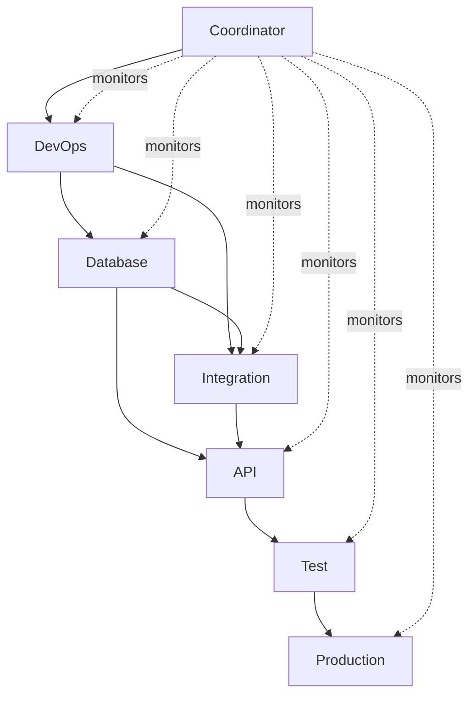

# 🐝 SWARM EXECUTION PROMPT: AUSTA Care Platform 45% → 100%

**CRITICAL:** This prompt is designed for claude-flow swarm execution with MCP memory persistence.
**Execute in parallel.** All agents MUST use coordination hooks.

---

## 🎯 IMMEDIATE EXECUTION COMMAND

```bash
# Initialize swarm with 6 specialized agents
npx claude-flow@alpha swarm --agents 6 --topology hierarchical --task "Complete AUSTA Care Platform to 100%"
```

---

## 🧠 SWARM TOPOLOGY & ROLES

### Central Coordinator (Required)
**Agent ID:** `coordinator-austa`
**Role:** Hive-mind intelligence, dependency management, progress tracking
**Memory Keys:** `austa/coordination/*`
**Responsibilities:**
- Monitor all agent progress via MCP memory
- Resolve blocking dependencies
- Optimize parallel execution
- Generate status reports every 4 hours

### Agent 1: DevOps Engineer
**Agent ID:** `devops-env`
**Memory Keys:** `austa/week1/devops/*`
**Dependencies:** None (can start immediately)
**Tasks:**
- Environment file creation (.env.development, .env.staging, .env.production)
- Build fixes (@types/jest, @types/node)
- Infrastructure connection testing
- Server startup verification

### Agent 2: Database Engineer
**Agent ID:** `database-init`
**Memory Keys:** `austa/week1/database/*`
**Dependencies:** `devops-env` (needs .env files)
**Tasks:**
- Prisma migration execution
- Seed data creation
- Database initialization
- Connection verification

### Agent 3: Integration Engineer
**Agent ID:** `integration-dev`
**Memory Keys:** `austa/week2/integrations/*`
**Dependencies:** `devops-env`, `database-init`
**Tasks:**
- Create integrations/ directory structure
- WhatsApp Business API client (official Meta API)
- OpenAI client with function calling
- Tasy ERP REST client
- FHIR gateway client

### Agent 4: API Engineer
**Agent ID:** `api-dev`
**Memory Keys:** `austa/week2-3/api/*`
**Dependencies:** `database-init`, `integration-dev`
**Tasks:**
- Complete all controllers (user, conversation, health-data, document, gamification, admin)
- Complete all routes
- Validation schemas (Zod)
- Route mounting in server.ts

### Agent 5: Test Engineer
**Agent ID:** `test-qa`
**Memory Keys:** `austa/week4/testing/*`
**Dependencies:** `api-dev` (needs completed endpoints)
**Tasks:**
- Unit tests for all 42 services
- Unit tests for all controllers
- Integration tests for API endpoints
- E2E tests for critical flows
- Target: >80% coverage

### Agent 6: Production Engineer
**Agent ID:** `prod-ready`
**Memory Keys:** `austa/week5-6/production/*`
**Dependencies:** `test-qa` (needs passing tests)
**Tasks:**
- Security hardening
- Missing middleware (audit, sanitization)
- Monitoring setup (Grafana dashboards)
- Documentation (OpenAPI specs)
- Production deployment preparation

---

## 📊 DEPENDENCY GRAPH



**Parallel Execution Waves:**
- **Wave 1:** DevOps (starts immediately)
- **Wave 2:** Database + Integration (after DevOps env files ready)
- **Wave 3:** API (after Database + Integration complete)
- **Wave 4:** Test (after API complete)
- **Wave 5:** Production (after Test passing)

---

## 🚀 SWARM INITIALIZATION (EXECUTE THIS)

**CRITICAL:** Send this as ONE message with all BatchTool operations.

```javascript
// Message 1: Initialize swarm and spawn ALL agents
[BatchTool]:
  // MCP: Initialize swarm coordination
  mcp__claude-flow__swarm_init({
    topology: "hierarchical",
    maxAgents: 7,  // 6 workers + 1 coordinator
    strategy: "parallel",
    persistMemory: true,
    sessionId: "austa-complete-" + Date.now()
  })

  // MCP: Spawn coordinator (central intelligence)
  mcp__claude-flow__agent_spawn({
    type: "coordinator",
    name: "AUSTA Coordinator",
    role: "hive_mind",
    memoryPattern: "austa/coordination/*"
  })

  // MCP: Spawn worker agents
  mcp__claude-flow__agent_spawn({ type: "devops", name: "DevOps Engineer" })
  mcp__claude-flow__agent_spawn({ type: "database", name: "Database Engineer" })
  mcp__claude-flow__agent_spawn({ type: "integration", name: "Integration Engineer" })
  mcp__claude-flow__agent_spawn({ type: "api", name: "API Engineer" })
  mcp__claude-flow__agent_spawn({ type: "test", name: "Test Engineer" })
  mcp__claude-flow__agent_spawn({ type: "production", name: "Production Engineer" })

  // TodoWrite: ALL tasks in ONE call (20+ todos)
  TodoWrite({
    todos: [
      // Week 1 - Wave 1
      {id: "w1-env-dev", content: "Create .env.development with 50+ vars", status: "pending", priority: "high", agent: "devops-env", wave: 1},
      {id: "w1-env-staging", content: "Create .env.staging", status: "pending", priority: "high", agent: "devops-env", wave: 1},
      {id: "w1-env-prod", content: "Create .env.production", status: "pending", priority: "high", agent: "devops-env", wave: 1},
      {id: "w1-build-fix", content: "Install @types/jest, @types/node", status: "pending", priority: "high", agent: "devops-env", wave: 1},
      {id: "w1-compile", content: "Fix TypeScript compilation errors", status: "pending", priority: "high", agent: "devops-env", wave: 1},

      // Week 1 - Wave 2 (depends on env files)
      {id: "w1-db-migrate", content: "Run prisma migrate dev --name init", status: "pending", priority: "high", agent: "database-init", wave: 2, dependsOn: ["w1-env-dev"]},
      {id: "w1-db-seed", content: "Create and execute seed data", status: "pending", priority: "high", agent: "database-init", wave: 2, dependsOn: ["w1-db-migrate"]},
      {id: "w1-infra-test", content: "Test Kafka, Redis, MongoDB connections", status: "pending", priority: "high", agent: "devops-env", wave: 2, dependsOn: ["w1-env-dev"]},
      {id: "w1-server-start", content: "Verify npm run dev succeeds", status: "pending", priority: "high", agent: "devops-env", wave: 2, dependsOn: ["w1-infra-test"]},

      // Week 2 - Wave 2 (parallel with database)
      {id: "w2-int-dir", content: "Create src/integrations/ structure", status: "pending", priority: "high", agent: "integration-dev", wave: 2, dependsOn: ["w1-env-dev"]},
      {id: "w2-whatsapp", content: "WhatsApp Business API client (official)", status: "pending", priority: "high", agent: "integration-dev", wave: 2, dependsOn: ["w2-int-dir"]},
      {id: "w2-openai", content: "OpenAI client with function calling", status: "pending", priority: "high", agent: "integration-dev", wave: 2, dependsOn: ["w2-int-dir"]},
      {id: "w2-tasy", content: "Tasy ERP REST API client", status: "pending", priority: "high", agent: "integration-dev", wave: 2, dependsOn: ["w2-int-dir"]},
      {id: "w2-validation", content: "Create src/validation/ with Zod schemas", status: "pending", priority: "medium", agent: "api-dev", wave: 2, dependsOn: ["w1-env-dev"]},

      // Week 3 - Wave 3 (depends on integrations)
      {id: "w3-controllers", content: "Complete all 12 controllers (full CRUD)", status: "pending", priority: "high", agent: "api-dev", wave: 3, dependsOn: ["w1-db-seed", "w2-openai"]},
      {id: "w3-routes", content: "Complete all 8 routes and mount in server.ts", status: "pending", priority: "high", agent: "api-dev", wave: 3, dependsOn: ["w3-controllers"]},
      {id: "w3-middleware", content: "Add audit, sanitization, cors middleware", status: "pending", priority: "medium", agent: "api-dev", wave: 3, dependsOn: ["w3-routes"]},

      // Week 4 - Wave 4 (depends on API)
      {id: "w4-unit-services", content: "Unit tests for 42 services", status: "pending", priority: "high", agent: "test-qa", wave: 4, dependsOn: ["w3-controllers"]},
      {id: "w4-unit-controllers", content: "Unit tests for 12 controllers", status: "pending", priority: "high", agent: "test-qa", wave: 4, dependsOn: ["w3-controllers"]},
      {id: "w4-integration", content: "Integration tests for API endpoints", status: "pending", priority: "high", agent: "test-qa", wave: 4, dependsOn: ["w3-routes"]},
      {id: "w4-e2e", content: "E2E tests for critical flows", status: "pending", priority: "medium", agent: "test-qa", wave: 4, dependsOn: ["w4-integration"]},
      {id: "w4-coverage", content: "Verify >80% test coverage", status: "pending", priority: "high", agent: "test-qa", wave: 4, dependsOn: ["w4-unit-services", "w4-unit-controllers"]},

      // Week 5-6 - Wave 5 (depends on tests)
      {id: "w5-security", content: "Security hardening and audit", status: "pending", priority: "high", agent: "prod-ready", wave: 5, dependsOn: ["w4-coverage"]},
      {id: "w5-monitoring", content: "Grafana dashboards and alerts", status: "pending", priority: "high", agent: "prod-ready", wave: 5, dependsOn: ["w4-coverage"]},
      {id: "w6-docs", content: "OpenAPI specs and documentation", status: "pending", priority: "medium", agent: "prod-ready", wave: 5, dependsOn: ["w3-routes"]},
      {id: "w6-deploy", content: "Production deployment preparation", status: "pending", priority: "high", agent: "prod-ready", wave: 5, dependsOn: ["w5-security", "w5-monitoring"]}
    ]
  })

  // MCP: Store initial state in memory
  mcp__claude-flow__memory_usage({
    action: "store",
    key: "austa/coordination/init",
    value: {
      timestamp: Date.now(),
      swarmId: "austa-complete",
      topology: "hierarchical",
      agents: 7,
      totalTasks: 25,
      currentWave: 1,
      status: "initialized"
    }
  })
```

---

## 🔗 COORDINATION PROTOCOL (MANDATORY FOR ALL AGENTS)

### Before Starting Work
```bash
# Load session context and check dependencies
npx claude-flow@alpha hooks pre-task \
  --description "Your task description" \
  --session-id "austa-complete" \
  --auto-spawn-agents false

# Restore previous session state
npx claude-flow@alpha hooks session-restore \
  --session-id "austa-complete" \
  --load-memory true
```

### During Work (After EVERY File Operation)
```bash
# Store progress in MCP memory
npx claude-flow@alpha hooks post-edit \
  --file "path/to/file" \
  --memory-key "austa/[agent-id]/[task-id]"

# Check if unblocking other agents
npx claude-flow@alpha hooks notification \
  --message "Task [id] complete - unblocking [dependent-task-ids]" \
  --telemetry true
```

### After Completing Task
```bash
# Finalize task and analyze performance
npx claude-flow@alpha hooks post-task \
  --task-id "[task-id]" \
  --analyze-performance true \
  --update-memory true

# Update coordination memory
mcp__claude-flow__memory_usage {
  action: "store",
  key: "austa/coordination/tasks/[task-id]",
  value: {
    taskId: "[task-id]",
    agent: "[agent-id]",
    status: "completed",
    timestamp: Date.now(),
    filesChanged: ["file1", "file2"],
    nextTasks: ["dependent-task-1", "dependent-task-2"]
  }
}
```

---

## 📋 COORDINATOR AGENT INSTRUCTIONS

**You are the central coordinator.** Execute these responsibilities:

### 1. Monitor Progress Every 4 Hours
```javascript
// Check all agent progress
mcp__claude-flow__memory_usage({
  action: "list",
  pattern: "austa/*/tasks/*"
})

// Generate status report
const completed = tasks.filter(t => t.status === "completed").length
const inProgress = tasks.filter(t => t.status === "in_progress").length
const blocked = tasks.filter(t => t.status === "blocked").length

// Store report
mcp__claude-flow__memory_usage({
  action: "store",
  key: "austa/coordination/status/" + Date.now(),
  value: { completed, inProgress, blocked, timestamp: Date.now() }
})
```

### 2. Resolve Blocking Dependencies
```javascript
// Identify blocked tasks
const blockedTasks = todos.filter(t => {
  return t.status === "pending" &&
         t.dependsOn.some(dep => !isCompleted(dep))
})

// Notify agents when dependencies clear
blockedTasks.forEach(task => {
  if (task.dependsOn.every(dep => isCompleted(dep))) {
    notifyAgent(task.agent, "Task " + task.id + " unblocked - ready to start")
  }
})
```

### 3. Optimize Wave Execution
```javascript
// Start wave when all previous wave tasks complete
function canStartWave(waveNum) {
  const prevWave = todos.filter(t => t.wave === waveNum - 1)
  return prevWave.every(t => t.status === "completed")
}

// Trigger next wave
if (canStartWave(currentWave + 1)) {
  currentWave++
  notifyAllAgents("Wave " + currentWave + " starting - begin your tasks")
}
```

### 4. Generate Completion Report
```javascript
// When all tasks complete
if (todos.every(t => t.status === "completed")) {
  mcp__claude-flow__memory_usage({
    action: "store",
    key: "austa/coordination/final-report",
    value: {
      completed: true,
      duration: Date.now() - startTime,
      tasksCompleted: todos.length,
      filesChanged: getAllChangedFiles(),
      testsWritten: getTestCount(),
      coverage: getCoveragePercent()
    }
  })
}
```

---

## 🎯 AGENT TASK EXECUTION TEMPLATE

**Use this pattern for EVERY agent task:**

```javascript
// 1. Check dependencies BEFORE starting
const dependencies = todos.find(t => t.id === myTaskId).dependsOn
const ready = dependencies.every(dep => {
  const depTask = mcp__claude-flow__memory_usage({
    action: "retrieve",
    key: "austa/coordination/tasks/" + dep
  })
  return depTask?.status === "completed"
})

if (!ready) {
  updateStatus(myTaskId, "blocked")
  return // Wait for coordinator to notify
}

// 2. Execute pre-task hooks
Bash("npx claude-flow@alpha hooks pre-task --description '" + myTaskDescription + "'")

// 3. Do the actual work
[BatchTool]:
  Write("file1.ts", content1)
  Write("file2.ts", content2)
  Write("file3.ts", content3)
  Bash("npm install dependency1 dependency2")
  Bash("npm test -- file1.test.ts")

// 4. Store progress after each major step
Bash("npx claude-flow@alpha hooks post-edit --file 'file1.ts' --memory-key 'austa/" + agentId + "/" + taskId + "/step1'")

// 5. Complete task and update memory
Bash("npx claude-flow@alpha hooks post-task --task-id '" + taskId + "' --analyze-performance true")

mcp__claude-flow__memory_usage({
  action: "store",
  key: "austa/coordination/tasks/" + taskId,
  value: {
    status: "completed",
    agent: agentId,
    timestamp: Date.now(),
    filesChanged: ["file1.ts", "file2.ts", "file3.ts"],
    testsAdded: ["file1.test.ts"]
  }
})

// 6. Notify coordinator
Bash("npx claude-flow@alpha hooks notification --message 'Task " + taskId + " completed - unblocking dependent tasks'")
```

---

## 🔥 CRITICAL SUCCESS CRITERIA

**Before marking ANY task complete, verify:**

### DevOps Agent
- [ ] `npm run dev` starts without errors
- [ ] All infrastructure clients connect (Kafka, Redis, MongoDB)
- [ ] Health endpoint returns 200
- [ ] Metrics endpoint returns Prometheus data

### Database Agent
- [ ] `npx prisma migrate status` shows migrations applied
- [ ] Database has seed data
- [ ] Prisma Client generates without errors
- [ ] All models accessible via ORM

### Integration Agent
- [ ] `src/integrations/` directory exists
- [ ] WhatsApp client can send test message
- [ ] OpenAI client can make prediction
- [ ] Tasy client can query patient data

### API Agent
- [ ] All 12 controllers have full CRUD
- [ ] All 8 routes mounted and tested
- [ ] Validation middleware works
- [ ] Postman collection can hit all endpoints

### Test Agent
- [ ] `npm test` passes with >80% coverage
- [ ] All services have unit tests
- [ ] All controllers have unit tests
- [ ] E2E tests cover critical flows

### Production Agent
- [ ] Security audit passes
- [ ] Grafana dashboards display metrics
- [ ] OpenAPI spec generates
- [ ] Deployment succeeds to staging

---

## 📊 MEMORY PERSISTENCE STRUCTURE

**All agents MUST use this memory hierarchy:**

```
austa/
├── coordination/
│   ├── init                    # Swarm initialization data
│   ├── status/[timestamp]      # Progress reports every 4h
│   ├── tasks/[task-id]         # Individual task completion
│   └── final-report            # Completion summary
│
├── week1/
│   ├── devops/
│   │   ├── env-files           # .env creation progress
│   │   ├── build-fixes         # TypeScript fixes
│   │   └── server-startup      # Startup verification
│   └── database/
│       ├── migrations          # Migration execution
│       └── seed-data           # Seed script creation
│
├── week2/
│   ├── integrations/
│   │   ├── whatsapp           # WhatsApp client
│   │   ├── openai             # OpenAI client
│   │   └── tasy               # Tasy client
│   └── api/
│       └── validation         # Zod schemas
│
├── week3/
│   └── api/
│       ├── controllers        # Controller completion
│       ├── routes             # Route completion
│       └── middleware         # Middleware additions
│
├── week4/
│   └── testing/
│       ├── unit              # Unit test results
│       ├── integration       # Integration test results
│       └── coverage          # Coverage reports
│
└── week5-6/
    └── production/
        ├── security          # Security audit
        ├── monitoring        # Grafana setup
        ├── docs              # OpenAPI generation
        └── deployment        # Production deployment
```

---

## ⚡ PARALLEL EXECUTION BATCHES

**Coordinator: Trigger these batches when dependencies clear**

### Batch 1 (Wave 1) - Start Immediately
```javascript
[BatchTool]:
  // DevOps agent - ALL environment tasks in parallel
  Task(`DevOps Agent: You are devops-env.

    MANDATORY COORDINATION:
    1. Run: npx claude-flow@alpha hooks pre-task --description "environment-setup"
    2. After EVERY file: npx claude-flow@alpha hooks post-edit --file "[file]" --memory-key "austa/week1/devops/[step]"
    3. At end: npx claude-flow@alpha hooks post-task --task-id "w1-env-setup"

    Tasks (execute in parallel):
    - Create .env.development with 50+ required variables
    - Create .env.staging with production-like config
    - Create .env.production with strict security
    - Install @types/jest, @types/node
    - Fix all TypeScript compilation errors
    - Verify npm run build succeeds

    Store completion in: austa/week1/devops/complete
  `)
```

### Batch 2 (Wave 2) - After .env files ready
```javascript
[BatchTool]:
  // Database agent
  Task(`Database Agent: You are database-init.

    Dependencies: Wait for austa/week1/devops/env-files to be completed

    MANDATORY COORDINATION:
    1. Check dependency: mcp__claude-flow__memory_usage retrieve austa/week1/devops/env-files
    2. If not ready: updateStatus("blocked") and wait
    3. Run hooks pre-task, post-edit, post-task

    Tasks:
    - Run npx prisma generate
    - Run npx prisma migrate dev --name init
    - Create seed scripts in prisma/seed/
    - Execute seed data
    - Verify Prisma Client works

    Store completion in: austa/week1/database/complete
  `)

  // Integration agent (parallel with database)
  Task(`Integration Agent: You are integration-dev.

    Dependencies: Wait for austa/week1/devops/env-files to be completed

    MANDATORY COORDINATION:
    1. Check dependency: mcp__claude-flow__memory_usage retrieve austa/week1/devops/env-files
    2. Run coordination hooks

    Tasks:
    - Create src/integrations/ structure
    - Build WhatsApp Business API client (official Meta API)
    - Build OpenAI client with function calling
    - Build Tasy ERP REST client
    - Build FHIR gateway client

    Store completion in: austa/week2/integrations/complete
  `)
```

### Batch 3 (Wave 3) - After Database + Integrations
```javascript
[BatchTool]:
  Task(`API Agent: You are api-dev.

    Dependencies:
    - austa/week1/database/complete
    - austa/week2/integrations/complete

    Tasks:
    - Create src/validation/ with Zod schemas for all endpoints
    - Complete all 12 controllers with full CRUD
    - Complete all 8 routes
    - Mount routes in server.ts
    - Add audit, sanitization, cors middleware

    Store completion in: austa/week3/api/complete
  `)
```

### Batch 4 (Wave 4) - After API complete
```javascript
[BatchTool]:
  Task(`Test Agent: You are test-qa.

    Dependencies: austa/week3/api/complete

    Tasks:
    - Unit tests for all 42 services
    - Unit tests for all 12 controllers
    - Integration tests for all API endpoints
    - E2E tests for critical flows
    - Verify >80% coverage

    Store completion in: austa/week4/testing/complete
  `)
```

### Batch 5 (Wave 5) - After Tests pass
```javascript
[BatchTool]:
  Task(`Production Agent: You are prod-ready.

    Dependencies: austa/week4/testing/complete

    Tasks:
    - Security hardening and audit
    - Grafana dashboards setup
    - Alert rules configuration
    - OpenAPI spec generation
    - Production deployment preparation

    Store completion in: austa/week5-6/production/complete
  `)
```

---

## 🎯 EXECUTION START COMMAND

**Run this SINGLE command to begin swarm execution:**

```bash
npx claude-flow@alpha execute --prompt ./docs/SWARM_EXECUTION_PROMPT.md --parallel true --persist-memory true
```

**Or spawn manually in Claude Code:**

Send this as ONE message:
```
Initialize AUSTA Care Platform swarm execution using the prompt at docs/SWARM_EXECUTION_PROMPT.md

Execute with:
- 7 agents (6 workers + 1 coordinator)
- Hierarchical topology
- Parallel execution where dependencies allow
- MCP memory persistence enabled
- All coordination hooks mandatory

Begin Wave 1 immediately.
```

---

## ✅ COMPLETION VERIFICATION

**Coordinator: Run this final check when all tasks complete**

```javascript
// Verify all success criteria
const checks = [
  verify("npm run dev starts", () => Bash("npm run dev --prefix ./austa-care-platform/backend")),
  verify("Health endpoint works", () => Bash("curl http://localhost:3000/health")),
  verify("Metrics endpoint works", () => Bash("curl http://localhost:3000/metrics")),
  verify("Tests pass", () => Bash("npm test --prefix ./austa-care-platform/backend")),
  verify("Coverage >80%", () => checkCoverage() > 80),
  verify("Build succeeds", () => Bash("npm run build --prefix ./austa-care-platform/backend")),
  verify("All integrations work", () => testIntegrations())
]

const allPassed = checks.every(c => c.result === true)

mcp__claude-flow__memory_usage({
  action: "store",
  key: "austa/coordination/completion",
  value: {
    timestamp: Date.now(),
    allChecksPassed: allPassed,
    checks: checks,
    readyForProduction: allPassed
  }
})
```

---

**STATUS:** Ready for swarm execution
**MEMORY PERSISTENCE:** MCP enabled via claude-flow hooks
**PARALLEL OPTIMIZATION:** 5 execution waves with dependency management
**COORDINATION:** Central coordinator with hive-mind intelligence
**TIMELINE:** 4-6 weeks with 6 parallel agents
