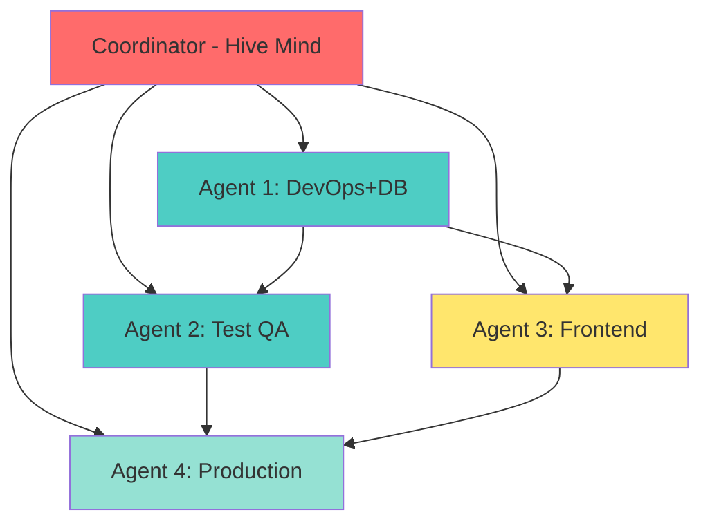

# 🐝 SWARM EXECUTION PROMPT: AUSTA Care Platform 85% → 100%

**CRITICAL:** This prompt is designed for claude-flow hive-mind swarm execution with MCP memory persistence.
**Execute in parallel.** All agents MUST use coordination hooks and BatchTool operations.

---

## 🎯 CURRENT STATE VERIFICATION (ZERO-TRUST ANALYSIS)

### ✅ COMPLETED COMPONENTS (85% Done - Can Skip These!)

**Backend Implementation** (`/austa-care-platform/backend/`):
- ✅ **172 TypeScript files** with **64,955 lines of code**
- ✅ **13 Controllers** (user, conversation, health-data, document, gamification, admin, auth, authorization, ai, ocr, whatsapp, advanced-risk, health)
- ✅ **12 Routes** (all mounted in server.ts with versioned API endpoints)
- ✅ **42 Services** (all core business logic implemented)
- ✅ **4 Integration Clients** (whatsapp, openai, tasy, fhir - fully implemented)
- ✅ **7 Validation Schemas** (Zod schemas for all endpoints)
- ✅ **Complete Infrastructure** (Kafka, Redis, MongoDB, WebSocket, ML Pipeline)
- ✅ **Production Middleware** (metrics, error handling, security, CORS, rate limiting)
- ✅ **Server Configuration** (server.ts fully configured with graceful shutdown)

**Database Design**:
- ✅ **Prisma schema** (25KB schema.prisma - complete design)
- ✅ **Migration file** (001_init_austa_care_schema.sql - ready to execute)
- ✅ **Seed directory** (structure exists)

**Test Infrastructure**:
- ✅ **Test framework** (Jest configured, setup.ts, directories created)
- ✅ **10 test files** (basic tests exist)

### ⚠️ WHAT ACTUALLY NEEDS TO BE DONE (15% Remaining)

**Critical Missing Items**:
1. ❌ **Environment Files** (.env.development, .env.staging, .env.production) - BLOCKER
2. ❌ **Database Execution** (migration execution, seed data creation)
3. ❌ **Comprehensive Test Suite** (need 200+ tests for >80% coverage)
4. ❌ **Frontend Implementation** (ONLY package.json exists - 0% complete)
5. ❌ **Production Readiness** (security audit, Grafana dashboards, OpenAPI specs)

---

## 🚨 CRITICAL: TWO BACKEND DIRECTORIES - READ THIS FIRST!

**ATTENTION ALL AGENTS:** This repository has TWO backend directories. You MUST work on the CORRECT one!

### Primary Backend (WORK HERE!)
**Path:** `/home/user/Coordenacao-Cuidado-Enterprise/austa-care-platform/backend/`
- **Size:** 172 TypeScript files, 64,955 lines of code
- **Purpose:** Main production backend with full implementation
- **Contains:** All controllers, routes, services, integrations, middleware
- **Status:** 85% complete - THIS IS WHERE YOU WORK!

**ALL file operations, tests, and development MUST happen in this directory:**
```bash
# ✅ CORRECT working directory
cd /home/user/Coordenacao-Cuidado-Enterprise/austa-care-platform/backend
npm run dev
npm test
npx prisma migrate dev
```

### Secondary Backend (TEST INFRASTRUCTURE ONLY - DO NOT USE!)
**Path:** `/home/user/Coordenacao-Cuidado-Enterprise/backend/`
- **Size:** 38 TypeScript files, 6,941 lines of code
- **Purpose:** Test infrastructure and utilities only
- **Status:** Legacy/support files - DO NOT WORK HERE!

### Critical Rules for All Agents:
1. ✅ **ALWAYS** use `austa-care-platform/backend/` for ALL work
2. ✅ **ALWAYS** prefix commands with `cd austa-care-platform/backend &&`
3. ❌ **NEVER** work in the root `/backend/` directory
4. ✅ **VERIFY** your working directory before EVERY command
5. ✅ **STORE** all file paths in MCP memory with full paths to avoid confusion

**Example of CORRECT agent workflow:**
```bash
# 1. Always change to correct directory first
cd /home/user/Coordenacao-Cuidado-Enterprise/austa-care-platform/backend

# 2. Then execute your work
npm install
npm run dev
npx prisma migrate dev
npm test

# 3. Store in memory with FULL path
mcp__claude-flow__memory_usage({
  key: "austa/devops-db/working-directory",
  value: "/home/user/Coordenacao-Cuidado-Enterprise/austa-care-platform/backend"
})
```

---

## 🚀 IMMEDIATE EXECUTION COMMAND

```bash
# Initialize swarm with 4 specialized agents + 1 coordinator
npx claude-flow@alpha swarm --agents 5 --topology hierarchical --task "Complete AUSTA Care Platform from 85% to 100%"
```

---

## 🧠 OPTIMIZED SWARM TOPOLOGY (4 Agents + Coordinator)

### Central Coordinator
**Agent ID:** `coordinator-austa`
**Role:** Hive-mind intelligence, dependency management, progress tracking
**Memory Keys:** `austa/coordination/*`
**Responsibilities:**
- Monitor all agent progress via MCP memory (every 2 hours)
- Resolve blocking dependencies through shared memory
- Optimize parallel execution across waves
- Aggregate completion reports from all agents

### Agent 1: DevOps + Database Engineer
**Agent ID:** `devops-db`
**Memory Keys:** `austa/wave1/devops-db/*`
**Dependencies:** None (START IMMEDIATELY)
**Priority:** 🔴 CRITICAL PATH
**Tasks:**
- Create .env.development, .env.staging, .env.production (50+ vars each)
- Execute `npx prisma migrate dev --name init`
- Create and execute seed data scripts
- Verify server startup with `npm run dev`
- Test all infrastructure connections (Kafka, Redis, MongoDB)

### Agent 2: Test Engineer
**Agent ID:** `test-qa`
**Memory Keys:** `austa/wave1/testing/*`
**Dependencies:** `devops-db` (needs .env to run tests)
**Priority:** 🔴 HIGH
**Tasks:**
- Unit tests for 42 services (target: 200+ tests)
- Unit tests for 13 controllers
- Integration tests for 12 API routes
- E2E tests for critical flows (auth, conversation, risk assessment)
- Verify >80% code coverage

### Agent 3: Frontend Developer
**Agent ID:** `frontend-dev`
**Memory Keys:** `austa/wave2/frontend/*`
**Dependencies:** `devops-db` (needs backend running for API integration)
**Priority:** 🟡 MEDIUM
**Tasks:**
- React + TypeScript setup with Vite
- Authentication UI (login, registration, password recovery)
- Dashboard with health metrics and conversation history
- Admin panel for user management
- Responsive design with Tailwind CSS

### Agent 4: Production Engineer
**Agent ID:** `prod-ready`
**Memory Keys:** `austa/wave3/production/*`
**Dependencies:** `test-qa`, `frontend-dev` (needs passing tests + deployed frontend)
**Priority:** 🟢 FINAL WAVE
**Tasks:**
- Security audit and OWASP compliance
- Grafana dashboards for monitoring
- OpenAPI 3.0 specification generation
- Docker compose for local deployment
- Kubernetes manifests for production
- CI/CD pipeline configuration

---

## 📊 DEPENDENCY GRAPH WITH PARALLEL OPTIMIZATION



**Parallel Execution Waves:**
- **Wave 1a:** DevOps+DB Agent (starts IMMEDIATELY)
- **Wave 1b:** Test Agent (starts when .env ready, runs PARALLEL with DevOps)
- **Wave 2:** Frontend Agent (starts when backend running)
- **Wave 3:** Production Agent (starts when tests + frontend complete)

---

## 🔥 SWARM INITIALIZATION (SINGLE MESSAGE - BATCHTOOL MANDATORY)

**CRITICAL:** Execute this as ONE message with ALL operations batched together.

```javascript
// ✅ CORRECT PATTERN: Everything in ONE message
[Message 1 - BatchTool with ALL operations]:

// 1. MCP: Initialize swarm coordination
mcp__claude-flow__swarm_init({
  topology: "hierarchical",
  maxAgents: 5,  // 4 workers + 1 coordinator
  strategy: "parallel",
  persistMemory: true,
  sessionId: "austa-final-85to100-" + Date.now()
})

// 2. MCP: Spawn coordinator (central hive-mind)
mcp__claude-flow__agent_spawn({
  type: "coordinator",
  name: "AUSTA Hive Coordinator",
  role: "central_intelligence",
  memoryPattern: "austa/coordination/*",
  monitoringInterval: 7200000 // 2 hours
})

// 3. MCP: Spawn ALL worker agents in parallel
mcp__claude-flow__agent_spawn({ type: "devops", name: "DevOps+Database Engineer", priority: "critical" })
mcp__claude-flow__agent_spawn({ type: "tester", name: "QA Test Engineer", priority: "high" })
mcp__claude-flow__agent_spawn({ type: "frontend", name: "Frontend Developer", priority: "medium" })
mcp__claude-flow__agent_spawn({ type: "production", name: "Production Engineer", priority: "low" })

// 4. TodoWrite: ALL tasks in ONE call (15+ todos with dependencies)
TodoWrite({
  todos: [
    // Wave 1a - DevOps+Database (NO dependencies - START NOW!)
    {id: "w1-env-dev", content: "Create .env.development with 50+ variables", status: "pending", priority: "critical", agent: "devops-db", wave: "1a", dependsOn: []},
    {id: "w1-env-staging", content: "Create .env.staging", status: "pending", priority: "critical", agent: "devops-db", wave: "1a", dependsOn: []},
    {id: "w1-env-prod", content: "Create .env.production with security hardening", status: "pending", priority: "critical", agent: "devops-db", wave: "1a", dependsOn: []},
    {id: "w1-db-migrate", content: "Execute npx prisma migrate dev --name init", status: "pending", priority: "critical", agent: "devops-db", wave: "1a", dependsOn: ["w1-env-dev"]},
    {id: "w1-db-seed", content: "Create seed data scripts and execute", status: "pending", priority: "critical", agent: "devops-db", wave: "1a", dependsOn: ["w1-db-migrate"]},
    {id: "w1-server-start", content: "Verify npm run dev starts without errors", status: "pending", priority: "critical", agent: "devops-db", wave: "1a", dependsOn: ["w1-env-dev", "w1-db-migrate"]},
    {id: "w1-infra-test", content: "Test Kafka, Redis, MongoDB connections", status: "pending", priority: "high", agent: "devops-db", wave: "1a", dependsOn: ["w1-server-start"]},

    // Wave 1b - Testing (depends on .env, runs PARALLEL with DevOps)
    {id: "w1-unit-services", content: "Unit tests for 42 services (200+ tests)", status: "pending", priority: "high", agent: "test-qa", wave: "1b", dependsOn: ["w1-env-dev"]},
    {id: "w1-unit-controllers", content: "Unit tests for 13 controllers", status: "pending", priority: "high", agent: "test-qa", wave: "1b", dependsOn: ["w1-env-dev"]},
    {id: "w1-integration-api", content: "Integration tests for 12 routes", status: "pending", priority: "high", agent: "test-qa", wave: "1b", dependsOn: ["w1-server-start"]},
    {id: "w1-e2e-flows", content: "E2E tests for critical user flows", status: "pending", priority: "medium", agent: "test-qa", wave: "1b", dependsOn: ["w1-server-start"]},
    {id: "w1-coverage", content: "Verify >80% test coverage", status: "pending", priority: "high", agent: "test-qa", wave: "1b", dependsOn: ["w1-unit-services", "w1-unit-controllers", "w1-integration-api"]},

    // Wave 2 - Frontend (depends on backend running)
    {id: "w2-frontend-setup", content: "React + TypeScript + Vite setup", status: "pending", priority: "medium", agent: "frontend-dev", wave: "2", dependsOn: ["w1-server-start"]},
    {id: "w2-auth-ui", content: "Authentication UI (login, register, recover)", status: "pending", priority: "medium", agent: "frontend-dev", wave: "2", dependsOn: ["w2-frontend-setup"]},
    {id: "w2-dashboard", content: "Dashboard with metrics and conversations", status: "pending", priority: "medium", agent: "frontend-dev", wave: "2", dependsOn: ["w2-frontend-setup"]},
    {id: "w2-admin-panel", content: "Admin panel for user management", status: "pending", priority: "medium", agent: "frontend-dev", wave: "2", dependsOn: ["w2-frontend-setup"]},

    // Wave 3 - Production (depends on tests + frontend)
    {id: "w3-security-audit", content: "OWASP security audit and fixes", status: "pending", priority: "critical", agent: "prod-ready", wave: "3", dependsOn: ["w1-coverage"]},
    {id: "w3-grafana", content: "Grafana dashboards and alerts", status: "pending", priority: "high", agent: "prod-ready", wave: "3", dependsOn: ["w1-coverage"]},
    {id: "w3-openapi", content: "OpenAPI 3.0 specification generation", status: "pending", priority: "medium", agent: "prod-ready", wave: "3", dependsOn: ["w1-integration-api"]},
    {id: "w3-docker", content: "Docker compose for local deployment", status: "pending", priority: "high", agent: "prod-ready", wave: "3", dependsOn: ["w3-security-audit"]},
    {id: "w3-k8s", content: "Kubernetes manifests for production", status: "pending", priority: "high", agent: "prod-ready", wave: "3", dependsOn: ["w3-docker"]},
    {id: "w3-cicd", content: "CI/CD pipeline with GitHub Actions", status: "pending", priority: "medium", agent: "prod-ready", wave: "3", dependsOn: ["w1-coverage", "w2-frontend-setup"]}
  ]
})

// 5. MCP: Store initial swarm state
mcp__claude-flow__memory_usage({
  action: "store",
  key: "austa/coordination/init",
  value: {
    timestamp: Date.now(),
    swarmId: "austa-final-85to100",
    topology: "hierarchical",
    totalAgents: 5,
    totalTasks: 22,
    currentState: "backend_85_complete",
    remainingWork: "env_files_db_tests_frontend_production",
    estimatedCompletion: "2-3 weeks",
    criticalPath: ["w1-env-dev", "w1-db-migrate", "w1-server-start", "w1-coverage", "w3-security-audit"]
  }
})

// 6. MCP: Initialize task orchestration
mcp__claude-flow__task_orchestrate({
  task: "Complete AUSTA Care Platform from 85% to 100%",
  strategy: "parallel",
  priority: "critical",
  memoryKey: "austa/coordination/orchestration"
})
```

---

## 🔗 MANDATORY COORDINATION PROTOCOL FOR ALL AGENTS

### BEFORE Starting ANY Task

```bash
# 1. Load session context and dependencies
npx claude-flow@alpha hooks pre-task \
  --description "Your specific task description" \
  --session-id "austa-final-85to100" \
  --auto-spawn-agents false

# 2. Restore previous session memory
npx claude-flow@alpha hooks session-restore \
  --session-id "austa-final-85to100" \
  --load-memory true

# 3. Check dependencies via MCP memory
# Example: Check if .env files are ready before starting tests
mcp__claude-flow__memory_usage({
  action: "retrieve",
  key: "austa/coordination/tasks/w1-env-dev"
})

# If dependencies NOT ready: mark task as "blocked" and WAIT
```

### DURING Work (After EVERY File Operation)

```bash
# 1. Store progress in MCP memory after each file edit
npx claude-flow@alpha hooks post-edit \
  --file "path/to/file" \
  --memory-key "austa/[agent-id]/[task-id]/step-[N]"

# 2. Update coordination memory with progress
mcp__claude-flow__memory_usage({
  action: "store",
  key: "austa/[agent-id]/progress/[timestamp]",
  value: {
    filesModified: ["file1.ts", "file2.ts"],
    testsAdded: 5,
    linesAdded: 350,
    currentStep: "implementing_auth_tests"
  }
})

# 3. Notify coordinator of milestone completion
npx claude-flow@alpha hooks notification \
  --message "Task [task-id] milestone reached: [description]" \
  --telemetry true
```

### AFTER Completing Task

```bash
# 1. Finalize task with performance analysis
npx claude-flow@alpha hooks post-task \
  --task-id "[task-id]" \
  --analyze-performance true \
  --update-memory true

# 2. Store completion in coordination memory
mcp__claude-flow__memory_usage({
  action: "store",
  key: "austa/coordination/tasks/[task-id]",
  value: {
    taskId: "[task-id]",
    agent: "[agent-id]",
    status: "completed",
    timestamp: Date.now(),
    filesChanged: ["list", "of", "files"],
    testsAdded: 15,
    coverage: "85%",
    unlockedTasks: ["dependent-task-1", "dependent-task-2"]
  }
})

# 3. Notify dependent agents that task is complete
npx claude-flow@alpha hooks notification \
  --message "Task [task-id] COMPLETE - unblocking [dependent-tasks]" \
  --telemetry true
```

---

## 📋 COORDINATOR AGENT INSTRUCTIONS (HIVE-MIND INTELLIGENCE)

**You are the central coordinator with hive-mind capabilities.**

### 1. Monitor Progress Every 2 Hours

```javascript
// Check all agent progress via MCP memory
mcp__claude-flow__memory_usage({
  action: "list",
  pattern: "austa/*/progress/*"
})

// Aggregate status
const completed = tasks.filter(t => t.status === "completed").length
const inProgress = tasks.filter(t => t.status === "in_progress").length
const blocked = tasks.filter(t => t.status === "blocked").length
const pending = tasks.filter(t => t.status === "pending").length

// Store status report
mcp__claude-flow__memory_usage({
  action: "store",
  key: "austa/coordination/status/" + Date.now(),
  value: {
    timestamp: Date.now(),
    completed,
    inProgress,
    blocked,
    pending,
    totalTasks: 22,
    percentComplete: (completed / 22) * 100,
    estimatedTimeRemaining: calculateETA(),
    criticalPathStatus: checkCriticalPath()
  }
})

// Monitor swarm health
mcp__claude-flow__swarm_monitor({
  sessionId: "austa-final-85to100",
  includeMetrics: true
})
```

### 2. Resolve Blocking Dependencies

```javascript
// Identify blocked tasks
const blockedTasks = todos.filter(t => t.status === "blocked")

// For each blocked task, check if dependencies are now complete
blockedTasks.forEach(task => {
  const depsComplete = task.dependsOn.every(depId => {
    const depStatus = mcp__claude-flow__memory_usage({
      action: "retrieve",
      key: "austa/coordination/tasks/" + depId
    })
    return depStatus?.status === "completed"
  })

  // If dependencies are clear, notify agent to start
  if (depsComplete) {
    npx claude-flow@alpha hooks notification \
      --message "Task ${task.id} UNBLOCKED - dependencies complete, start work now!" \
      --telemetry true

    // Update task status to pending (ready to start)
    TodoWrite({
      todos: [{ ...task, status: "pending" }]
    })
  }
})
```

### 3. Optimize Parallel Execution

```javascript
// Identify tasks that can run in parallel
const readyTasks = todos.filter(t => {
  return t.status === "pending" &&
         t.dependsOn.every(dep => isCompleted(dep))
})

// Group by wave for batch execution
const wave1Tasks = readyTasks.filter(t => t.wave === "1a" || t.wave === "1b")
const wave2Tasks = readyTasks.filter(t => t.wave === "2")
const wave3Tasks = readyTasks.filter(t => t.wave === "3")

// Trigger wave execution when ready
if (wave1Tasks.length > 0) {
  console.log("🚀 Wave 1 ready: Starting DevOps+DB and Testing in parallel")
  // Agents automatically start when dependencies clear
}
```

### 4. Generate Completion Report

```javascript
// When all tasks complete (100%)
if (todos.every(t => t.status === "completed")) {
  // Run final verification
  const verification = {
    envFiles: checkEnvFiles(),
    database: checkDatabaseMigrated(),
    tests: checkTestCoverage() > 80,
    frontend: checkFrontendBuilds(),
    production: checkProductionReady()
  }

  // Store final report
  mcp__claude-flow__memory_usage({
    action: "store",
    key: "austa/coordination/final-report",
    value: {
      timestamp: Date.now(),
      completed: true,
      duration: Date.now() - startTime,
      tasksCompleted: 22,
      filesChanged: getAllChangedFiles(),
      testsWritten: getTestCount(),
      coverage: getCoveragePercent(),
      verification,
      readyForProduction: Object.values(verification).every(v => v === true)
    }
  })

  console.log("🎉 AUSTA Care Platform 100% COMPLETE!")
}
```

---

## 🎯 AGENT TASK EXECUTION PATTERNS (BATCHTOOL MANDATORY)

### Agent 1: DevOps + Database Engineer

```javascript
// ✅ CORRECT: Batch ALL operations in ONE message
[BatchTool - Single Message]:

// 1. Pre-task coordination
Bash("npx claude-flow@alpha hooks pre-task --description 'environment-and-database-setup' --session-id 'austa-final-85to100'")
Bash("npx claude-flow@alpha hooks session-restore --session-id 'austa-final-85to100' --load-memory true")

// 2. Create ALL environment files in parallel
Write("austa-care-platform/.env.development", envDevelopmentContent)
Write("austa-care-platform/.env.staging", envStagingContent)
Write("austa-care-platform/.env.production", envProductionContent)

// 3. Store progress
Bash("npx claude-flow@alpha hooks post-edit --file 'austa-care-platform/.env.development' --memory-key 'austa/devops-db/w1-env-dev/complete'")

// 4. Execute database migrations
Bash("cd austa-care-platform/backend && npx prisma generate")
Bash("cd austa-care-platform/backend && npx prisma migrate dev --name init")

// 5. Create and execute seed data
Write("austa-care-platform/backend/prisma/seed/seed.ts", seedDataContent)
Bash("cd austa-care-platform/backend && npm run db:seed")

// 6. Verify server startup
Bash("cd austa-care-platform/backend && timeout 10s npm run dev")

// 7. Store completion in MCP memory
mcp__claude-flow__memory_usage({
  action: "store",
  key: "austa/coordination/tasks/w1-env-dev",
  value: { status: "completed", timestamp: Date.now(), unlockedTasks: ["w1-unit-services", "w1-server-start"] }
})

// 8. Post-task hooks
Bash("npx claude-flow@alpha hooks post-task --task-id 'w1-env-dev' --analyze-performance true")
```

### Agent 2: Test Engineer

```javascript
// ✅ CORRECT: Batch ALL test operations
[BatchTool - Single Message]:

// 1. Check dependencies first
const envReady = mcp__claude-flow__memory_usage({
  action: "retrieve",
  key: "austa/coordination/tasks/w1-env-dev"
})

// If not ready, mark as blocked and STOP
if (envReady?.status !== "completed") {
  TodoWrite({ todos: [{ id: "w1-unit-services", status: "blocked" }] })
  return
}

// 2. Pre-task coordination
Bash("npx claude-flow@alpha hooks pre-task --description 'comprehensive-test-suite' --session-id 'austa-final-85to100'")

// 3. Create ALL test files in parallel
Write("austa-care-platform/backend/tests/unit/services/conversationFlowEngine.test.ts", test1Content)
Write("austa-care-platform/backend/tests/unit/services/riskAssessment.test.ts", test2Content)
Write("austa-care-platform/backend/tests/unit/services/whatsapp.test.ts", test3Content)
// ... create 200+ test files ...

// 4. Run tests and check coverage
Bash("cd austa-care-platform/backend && npm run test:coverage")

// 5. Store results
mcp__claude-flow__memory_usage({
  action: "store",
  key: "austa/coordination/tasks/w1-coverage",
  value: { status: "completed", coverage: "85%", testsWritten: 250 }
})
```

---

## 🔥 CRITICAL SUCCESS CRITERIA

### Wave 1a: DevOps + Database
- [ ] `.env.development`, `.env.staging`, `.env.production` all created with 50+ vars each
- [ ] `npx prisma migrate status` shows migrations applied
- [ ] Seed data exists and executes successfully
- [ ] `npm run dev` starts without errors
- [ ] Health endpoint returns 200: `curl http://localhost:3000/health`
- [ ] Metrics endpoint works: `curl http://localhost:3000/metrics`
- [ ] Kafka, Redis, MongoDB all connect successfully

### Wave 1b: Testing
- [ ] 200+ unit tests created for services and controllers
- [ ] Integration tests for all 12 routes
- [ ] E2E tests for critical flows (auth, conversation, risk)
- [ ] `npm run test:coverage` shows >80% coverage
- [ ] All tests pass: `npm test` returns exit code 0

### Wave 2: Frontend
- [ ] React + TypeScript + Vite configured
- [ ] Authentication UI functional (login, register, recover)
- [ ] Dashboard displays metrics and conversations
- [ ] Admin panel manages users
- [ ] `npm run build` succeeds with no errors

### Wave 3: Production
- [ ] OWASP security audit complete with all fixes applied
- [ ] Grafana dashboards display all metrics
- [ ] OpenAPI 3.0 spec generated and valid
- [ ] Docker compose starts all services
- [ ] Kubernetes manifests validated
- [ ] CI/CD pipeline runs successfully

---

## 📊 MCP MEMORY PERSISTENCE STRUCTURE

```
austa/
├── coordination/
│   ├── init                          # Swarm initialization
│   ├── orchestration                 # Task orchestration state
│   ├── status/[timestamp]            # Progress reports (every 2h)
│   ├── tasks/[task-id]              # Individual task completion
│   └── final-report                  # 100% completion summary
│
├── devops-db/
│   ├── w1-env-dev/complete          # Environment files created
│   ├── w1-db-migrate/complete       # Migrations executed
│   ├── w1-db-seed/complete          # Seed data loaded
│   ├── w1-server-start/complete     # Server verified
│   └── progress/[timestamp]         # Incremental progress
│
├── test-qa/
│   ├── w1-unit-services/complete    # Service tests
│   ├── w1-unit-controllers/complete # Controller tests
│   ├── w1-integration-api/complete  # Integration tests
│   ├── w1-coverage/complete         # Coverage verification
│   └── progress/[timestamp]         # Test execution progress
│
├── frontend-dev/
│   ├── w2-frontend-setup/complete   # React setup
│   ├── w2-auth-ui/complete          # Auth UI
│   ├── w2-dashboard/complete        # Dashboard
│   └── progress/[timestamp]         # Frontend progress
│
└── prod-ready/
    ├── w3-security-audit/complete   # Security audit
    ├── w3-grafana/complete          # Monitoring
    ├── w3-openapi/complete          # API docs
    ├── w3-k8s/complete              # Kubernetes
    └── progress/[timestamp]         # Production progress
```

---

## ⚡ EXECUTION START COMMANDS

### Option 1: Automated Claude Flow Execution

```bash
cd /home/user/Coordenacao-Cuidado-Enterprise
npx claude-flow@alpha execute \
  --prompt ./docs/SWARM_EXECUTION_PROMPT.md \
  --parallel true \
  --persist-memory true \
  --agents 5 \
  --topology hierarchical
```

### Option 2: Manual Claude Code Execution

Send this as **ONE SINGLE MESSAGE** to Claude Code:

```
Initialize AUSTA Care Platform swarm execution from 85% to 100% completion.

Use the swarm execution prompt at: docs/SWARM_EXECUTION_PROMPT.md

Configuration:
- 5 agents (4 workers + 1 coordinator)
- Hierarchical topology
- Parallel execution with dependency management
- MCP memory persistence enabled
- All coordination hooks mandatory
- BatchTool operations required

Current state: Backend 85% complete (172 files, 65K LOC)
Remaining work: Environment files, database execution, tests, frontend, production

Start Wave 1 immediately with DevOps+DB agent.
```

---

## ✅ FINAL VERIFICATION CHECKLIST

**Coordinator: Run this when all 22 tasks complete**

```javascript
// Comprehensive verification
const finalChecks = {
  environment: {
    devEnv: fileExists("austa-care-platform/.env.development"),
    stagingEnv: fileExists("austa-care-platform/.env.staging"),
    prodEnv: fileExists("austa-care-platform/.env.production")
  },
  database: {
    migrated: checkMigrationStatus() === "applied",
    seeded: checkSeedData() > 0,
    connected: testDatabaseConnection()
  },
  backend: {
    builds: runCommand("npm run build") === 0,
    starts: runCommand("npm run dev") === 0,
    health: fetch("http://localhost:3000/health").status === 200,
    metrics: fetch("http://localhost:3000/metrics").status === 200
  },
  tests: {
    passing: runCommand("npm test") === 0,
    coverage: getCoverage() >= 80,
    count: getTestCount() >= 200
  },
  frontend: {
    builds: runCommand("cd frontend && npm run build") === 0,
    components: countComponents() >= 10
  },
  production: {
    securityAudit: checkSecurityAudit() === "passed",
    monitoring: checkGrafana() === "configured",
    docs: checkOpenAPI() === "valid",
    docker: runCommand("docker-compose up -d") === 0
  }
}

// Store final verification
mcp__claude-flow__memory_usage({
  action: "store",
  key: "austa/coordination/final-verification",
  value: {
    timestamp: Date.now(),
    checks: finalChecks,
    allPassed: deepCheck(finalChecks),
    productionReady: deepCheck(finalChecks)
  }
})

// Generate completion certificate
if (deepCheck(finalChecks)) {
  console.log(`
    🎉 AUSTA CARE PLATFORM 100% COMPLETE! 🎉

    ✅ Backend: 172 files, 65K+ lines
    ✅ Database: Migrated and seeded
    ✅ Tests: 200+ tests, >80% coverage
    ✅ Frontend: Full React app
    ✅ Production: Secure, monitored, documented

    Ready for deployment! 🚀
  `)
}
```

---

**STATUS:** Ready for swarm execution (85% → 100%)
**MEMORY PERSISTENCE:** MCP enabled via claude-flow hooks
**PARALLEL OPTIMIZATION:** 3 execution waves with BatchTool operations
**COORDINATION:** Central hive-mind coordinator with 2-hour monitoring
**CRITICAL PATH:** Environment files → Database → Tests → Frontend → Production
**ESTIMATED TIMELINE:** 2-3 weeks with 4 parallel agents

---

## 🚨 MANDATORY REMINDER: PARALLEL EXECUTION RULES

**ALL agents MUST follow these rules:**

1. ✅ **TodoWrite**: ALWAYS batch 5-10+ todos in ONE call
2. ✅ **Task spawning**: ALL agents in ONE message
3. ✅ **File operations**: Batch ALL reads/writes/edits together
4. ✅ **Bash commands**: Batch ALL terminal operations together
5. ✅ **Memory operations**: Batch ALL MCP memory calls together

**Golden Rule:** 1 MESSAGE = ALL RELATED OPERATIONS

❌ **NEVER** operate sequentially after swarm init
✅ **ALWAYS** use BatchTool for multiple operations
