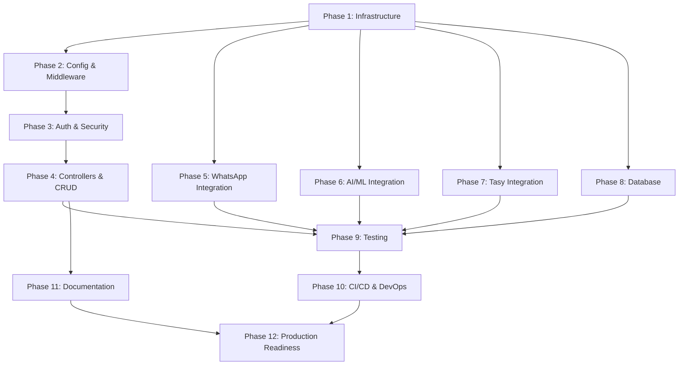

# 🐝 SWARM IMPLEMENTATION PLAN: AUSTA Care Platform Missing Components

**Plan Version:** 1.0
**Created:** November 15, 2025
**Target Branch:** `claude/forensics-analysis-architecture-01BQEQQA4tXnPdneXmLR9ydy`
**Swarm Type:** Hierarchical with Central Coordination
**Agent Count:** 8-12 agents (auto-determined by task complexity)
**Coordination:** Claude Flow MCP with memory persistence

---

## 🎯 MISSION OBJECTIVE

Implement ALL missing critical components identified in the forensics analysis to make the AUSTA Care Coordination Platform **functional and production-ready**, focusing on:

1. **Critical Infrastructure** (Kafka, Redis, MongoDB, WebSocket, ML Pipeline)
2. **Core Application Logic** (Auth, Controllers, Middleware)
3. **Essential Integrations** (WhatsApp Business API, OpenAI, Tasy ERP)
4. **Production Readiness** (Config, Tests, CI/CD, Monitoring)

**Success Criteria:**
- ✅ Application starts without errors
- ✅ All critical APIs functional
- ✅ Authentication/authorization working
- ✅ WhatsApp integration active
- ✅ Database migrations execute
- ✅ Basic tests passing
- ✅ CI/CD pipeline functional

---

## 🐝 SWARM ORCHESTRATION STRATEGY

### Swarm Configuration

```yaml
swarm_topology: hierarchical
max_agents: AUTO_DECIDE (8-12 recommended)
strategy: parallel_with_dependencies
memory_persistence: MANDATORY
coordination_tools: claude-flow MCP hooks

agent_types:
  - coordinator: 1 (orchestrates overall progress)
  - architect: 1 (ensures architectural consistency)
  - backend_developer: 3 (infrastructure, services, controllers)
  - integration_specialist: 2 (WhatsApp, OpenAI, Tasy)
  - security_engineer: 1 (auth, security, compliance)
  - qa_engineer: 1 (tests, validation)
  - devops_engineer: 1 (CI/CD, deployment)
  - documentation_specialist: 1 (updates docs, API specs)
```

### Mandatory Coordination Protocol

**EVERY AGENT MUST:**

```bash
# BEFORE starting ANY work:
npx claude-flow@alpha hooks pre-task \
  --description "[agent name]: [specific task]" \
  --auto-spawn-agents false

npx claude-flow@alpha hooks session-restore \
  --session-id "swarm-austa-implementation" \
  --load-memory true

# DURING work (after EVERY file operation):
npx claude-flow@alpha hooks post-edit \
  --file "[filepath]" \
  --memory-key "swarm/[agent-name]/[step-number]"

npx claude-flow@alpha hooks notification \
  --message "[what was accomplished]" \
  --telemetry true

# Check coordination with other agents:
npx claude-flow@alpha hooks pre-search \
  --query "[what to verify]" \
  --cache-results true

# AFTER completing work:
npx claude-flow@alpha hooks post-task \
  --task-id "[task-id]" \
  --analyze-performance true

npx claude-flow@alpha hooks session-end \
  --export-metrics true \
  --generate-summary true
```

---

## 📋 IMPLEMENTATION PHASES

### PHASE 1: CRITICAL INFRASTRUCTURE (Priority: 🔥 CRITICAL)

**Duration:** Week 1 (5-7 days)
**Agents:** Backend Developers (3), Coordinator (1)
**Dependency:** None - Can start immediately

#### Task 1.1: Infrastructure Client Implementations

**Agent: Backend Developer 1 - Kafka Specialist**

**Deliverables:**
```typescript
// File: backend/src/infrastructure/kafka/kafka.client.ts
export class KafkaClient {
  // Producer, consumer, admin client
  // Topic creation
  // Message publishing
  // Event handling
  // Error handling & retry
  // Graceful shutdown
}

// File: backend/src/infrastructure/kafka/kafka.config.ts
// Kafka configuration management

// File: backend/src/infrastructure/kafka/kafka.types.ts
// TypeScript interfaces for events

// File: backend/src/infrastructure/kafka/consumers/
// - message-received.consumer.ts
// - ai-analysis.consumer.ts
// - authorization.consumer.ts
// - notification.consumer.ts

// File: backend/src/infrastructure/kafka/producers/
// - event.producer.ts
```

**Technical Requirements:**
- Use kafkajs@2.2.4
- Implement producer with idempotent writes
- Implement consumer groups with auto-commit disabled
- Add dead-letter queue for failed messages
- Implement circuit breaker pattern
- Add Prometheus metrics for Kafka operations
- Support all topics defined in server.ts

**Coordination:**
```bash
# Before:
npx claude-flow@alpha hooks pre-task --description "Kafka Client Implementation"
npx claude-flow@alpha memory store --key "infrastructure/kafka/status" --value "in_progress"

# During:
# After each file creation:
npx claude-flow@alpha hooks post-edit --file "backend/src/infrastructure/kafka/kafka.client.ts"

# After completion:
npx claude-flow@alpha memory store --key "infrastructure/kafka/status" --value "complete"
npx claude-flow@alpha hooks post-task --task-id "kafka-implementation"
```

---

**Agent: Backend Developer 2 - Redis Specialist**

**Deliverables:**
```typescript
// File: backend/src/infrastructure/redis/redis.cluster.ts
export class RedisCluster {
  // Cluster connection
  // Get/Set operations
  // Hash operations
  // Pub/Sub
  // TTL management
  // Connection pooling
  // Failover handling
}

// File: backend/src/infrastructure/redis/redis.config.ts
// File: backend/src/infrastructure/redis/redis.types.ts

// File: backend/src/infrastructure/redis/services/
// - session.service.ts (user session management)
// - cache.service.ts (application caching)
// - rate-limiter.service.ts (rate limiting)
// - conversation-context.service.ts (conversation state)
```

**Technical Requirements:**
- Use ioredis@5.3.2
- Implement cluster mode with 3 masters, 3 replicas (config)
- Add connection retry with exponential backoff
- Implement cache warming strategies
- Add TTL management
- Support Redis Streams for real-time updates
- Add Prometheus metrics

---

**Agent: Backend Developer 3 - MongoDB & WebSocket Specialist**

**Deliverables (Part 1 - MongoDB):**
```typescript
// File: backend/src/infrastructure/mongodb/mongodb.client.ts
export class MongoDBClient {
  // Connection management
  // Database operations
  // Collection management
  // Change streams
  // GridFS for files
  // Connection pooling
}

// File: backend/src/infrastructure/mongodb/mongodb.config.ts
// File: backend/src/infrastructure/mongodb/models/
// - conversation.model.ts
// - message.model.ts
// - document.model.ts
// - knowledge-base.model.ts
```

**Technical Requirements:**
- Use mongodb@6.3.0
- Implement replica set connection
- Add change streams for real-time updates
- Implement GridFS for large document storage
- Add connection retry logic
- Implement proper indexing strategy
- Add Prometheus metrics

**Deliverables (Part 2 - WebSocket):**
```typescript
// File: backend/src/infrastructure/websocket/websocket.server.ts
export class WebSocketServer {
  // Socket.io initialization
  // Room management
  // Event handling
  // Authentication
  // Redis adapter integration
  // Namespace management
}

// File: backend/src/infrastructure/websocket/websocket.config.ts
// File: backend/src/infrastructure/websocket/handlers/
// - conversation.handler.ts
// - notification.handler.ts
// - real-time-updates.handler.ts

// File: backend/src/infrastructure/websocket/middleware/
// - auth.middleware.ts
// - rate-limiting.middleware.ts
```

**Technical Requirements:**
- Use socket.io@4.6.1
- Implement Redis adapter for horizontal scaling
- Add JWT authentication for WebSocket connections
- Implement room-based messaging
- Add connection management (reconnection, heartbeat)
- Implement rate limiting per socket
- Add Prometheus metrics

---

#### Task 1.2: ML Pipeline Infrastructure

**Agent: Backend Developer 3 - ML Specialist** (after completing MongoDB/WebSocket)

**Deliverables:**
```typescript
// File: backend/src/infrastructure/ml/ml-pipeline.service.ts
export class MLPipeline {
  // Model loading
  // Inference endpoint
  // Feature extraction
  // Model versioning
  // A/B testing framework
  // Performance monitoring
}

// File: backend/src/infrastructure/ml/models/
// - symptom-classifier.model.ts
// - risk-scorer.model.ts
// - intent-recognizer.model.ts
// - fraud-detector.model.ts

// File: backend/src/infrastructure/ml/features/
// - feature-extractor.ts
// - feature-transformer.ts

// File: backend/src/infrastructure/ml/config/
// - ml.config.ts
// - model-registry.ts
```

**Technical Requirements:**
- Use @tensorflow/tfjs-node@4.16.0
- Implement model loading from S3/local storage
- Add model versioning and registry
- Implement batch inference
- Add real-time inference endpoint
- Implement A/B testing framework
- Add model performance monitoring
- Support model hot-swapping

---

#### Task 1.3: Prometheus Metrics

**Agent: DevOps Engineer**

**Deliverables:**
```typescript
// File: backend/src/infrastructure/monitoring/prometheus.metrics.ts
export class PrometheusMetrics {
  // HTTP metrics (requests, latency, errors)
  // Business metrics (users, conversations, authorizations)
  // Infrastructure metrics (Kafka, Redis, MongoDB)
  // Custom metrics
}

// File: backend/src/infrastructure/monitoring/prometheus.config.ts
// File: backend/src/infrastructure/monitoring/middleware/
// - metrics.middleware.ts (Express middleware for HTTP metrics)
```

**Technical Requirements:**
- Use prom-client@15.1.0
- Implement standard HTTP metrics
- Add custom business metrics
- Implement metric aggregation
- Add metric labels (environment, service, endpoint)
- Export metrics endpoint at /metrics
- Add grafana dashboard configurations

---

### PHASE 2: CONFIGURATION & MIDDLEWARE (Priority: 🔥 CRITICAL)

**Duration:** Week 1 (parallel with Phase 1, days 3-5)
**Agents:** Security Engineer (1), Backend Developer (1)
**Dependency:** None - Can start immediately

#### Task 2.1: Configuration Management

**Agent: Security Engineer**

**Deliverables:**
```typescript
// File: backend/src/config/config.ts
export const config = {
  // Environment variables
  // Database configurations
  // API keys (encrypted)
  // Feature flags
  // Service configurations
}

// File: backend/src/config/environments/
// - development.ts
// - staging.ts
// - production.ts

// File: backend/src/config/secrets/
// - secrets.service.ts (AWS Secrets Manager / Vault integration)

// File: backend/.env.development
// File: backend/.env.staging
// File: backend/.env.production
// File: backend/.env.example (update)
```

**Technical Requirements:**
- Use dotenv@16.3.1
- Implement environment-specific configurations
- Add secrets management integration
- Implement configuration validation with Joi
- Add feature flag system
- Support hot-reloading of non-sensitive config
- Implement configuration encryption for secrets

**Environment Variables Required:**
```env
# Database
DATABASE_URL=
MONGODB_URI=
REDIS_CLUSTER_NODES=

# Kafka
KAFKA_BROKERS=
KAFKA_SASL_USERNAME=
KAFKA_SASL_PASSWORD=

# External APIs
OPENAI_API_KEY=
WHATSAPP_API_TOKEN=
WHATSAPP_PHONE_NUMBER_ID=
TASY_API_URL=
TASY_API_KEY=

# AWS
AWS_ACCESS_KEY_ID=
AWS_SECRET_ACCESS_KEY=
AWS_REGION=
AWS_S3_BUCKET=

# Security
JWT_SECRET=
JWT_EXPIRATION=
ENCRYPTION_KEY=

# Application
NODE_ENV=
PORT=
LOG_LEVEL=
```

---

#### Task 2.2: Middleware Implementations

**Agent: Backend Developer 1** (after Kafka implementation)

**Deliverables:**
```typescript
// File: backend/src/middleware/errorHandler.ts
export const errorHandler = (err, req, res, next) => {
  // Global error handling
  // Error logging
  // Error formatting
  // Error monitoring (Sentry integration)
}

// File: backend/src/middleware/notFoundHandler.ts
// 404 handler

// File: backend/src/middleware/auth.ts
export const authMiddleware = {
  // JWT verification
  // User extraction
  // Role-based access control
  // Token refresh
}

// File: backend/src/middleware/validation.ts
export const validate = (schema) => {
  // Request validation (body, params, query)
  // Zod schema validation
  // Error formatting
}

// File: backend/src/middleware/audit.ts
// HIPAA/LGPD audit logging middleware

// File: backend/src/middleware/rateLimiting.ts
// Advanced rate limiting (per user, per organization, per endpoint)

// File: backend/src/middleware/cors.ts
// Custom CORS logic

// File: backend/src/middleware/requestLogger.ts
// Structured request logging

// File: backend/src/middleware/sanitization.ts
// Input sanitization (XSS, SQL injection prevention)
```

**Technical Requirements:**
- Implement comprehensive error handling
- Add JWT authentication with refresh tokens
- Implement RBAC middleware
- Add Zod schema validation
- Implement audit logging compliant with HIPAA/LGPD
- Add advanced rate limiting (per user/org/endpoint)
- Add request sanitization
- Implement request ID tracking
- Add correlation ID for distributed tracing

---

### PHASE 3: AUTHENTICATION & SECURITY (Priority: 🔥 CRITICAL)

**Duration:** Week 1-2 (days 4-8)
**Agents:** Security Engineer (1), Backend Developer (1)
**Dependency:** Phase 2 (Configuration & Middleware)

#### Task 3.1: Authentication System

**Agent: Security Engineer**

**Deliverables:**
```typescript
// File: backend/src/services/auth/auth.service.ts
export class AuthService {
  // User registration
  // Login (password + OTP)
  // JWT generation
  // Token refresh
  // Password reset
  // Email/phone verification
}

// File: backend/src/services/auth/jwt.service.ts
// JWT operations

// File: backend/src/services/auth/password.service.ts
// Password hashing with bcrypt

// File: backend/src/services/auth/otp.service.ts
// OTP generation and verification

// File: backend/src/controllers/auth.ts (COMPLETE)
// Update existing auth controller with full implementation

// File: backend/src/routes/auth.routes.ts
// Authentication routes
```

**Technical Requirements:**
- Use bcrypt@5.1.1 for password hashing
- Use jsonwebtoken@9.0.2 for JWT
- Implement access token (15 min) + refresh token (7 days)
- Add OTP via WhatsApp for 2FA
- Implement password strength validation
- Add account lockout after failed attempts
- Implement LGPD consent tracking
- Add audit logging for all auth operations

---

#### Task 3.2: Security Services

**Agent: Security Engineer**

**Deliverables:**
```typescript
// File: backend/src/services/security/encryption.service.ts
export class EncryptionService {
  // AES-256 encryption
  // Field-level encryption for PHI/PII
  // Key rotation
  // Encryption at rest
}

// File: backend/src/services/security/rbac.service.ts
export class RBACService {
  // Role management
  // Permission checking
  // Resource-based access control
  // Organization-level access control
}

// File: backend/src/services/security/audit.service.ts (COMPLETE)
// Complete existing audit service

// File: backend/src/services/security/secret-manager.service.ts
// AWS Secrets Manager integration
```

**Technical Requirements:**
- Implement AES-256 encryption for sensitive data
- Add field-level encryption for PHI (health data)
- Implement RBAC with organization-level scoping
- Add audit logging compliant with HIPAA/LGPD
- Integrate with AWS Secrets Manager
- Implement key rotation strategies
- Add data masking for logs

---

### PHASE 4: CORE CONTROLLERS & CRUD (Priority: 🔥 CRITICAL)

**Duration:** Week 2 (days 5-10)
**Agents:** Backend Developer (2), QA Engineer (1)
**Dependency:** Phase 2 (Middleware), Phase 3 (Auth)

#### Task 4.1: Complete Core Controllers

**Agent: Backend Developer 1**

**Deliverables:**
```typescript
// File: backend/src/controllers/user.ts (COMPLETE)
// File: backend/src/controllers/conversation.ts (NEW)
// File: backend/src/controllers/health-data.ts (NEW)
// File: backend/src/controllers/document.ts (NEW)

// File: backend/src/routes/user.routes.ts (COMPLETE)
// File: backend/src/routes/conversation.routes.ts (NEW)
// File: backend/src/routes/health-data.routes.ts (NEW)
// File: backend/src/routes/document.routes.ts (NEW)
```

**API Endpoints Required:**

**User Management:**
```
POST   /api/v1/users              - Create user
GET    /api/v1/users/:id          - Get user by ID
PUT    /api/v1/users/:id          - Update user
DELETE /api/v1/users/:id          - Soft delete user
GET    /api/v1/users/:id/profile  - Get user profile
PUT    /api/v1/users/:id/profile  - Update user profile
GET    /api/v1/users/:id/health   - Get user health data
POST   /api/v1/users/:id/documents - Upload document
GET    /api/v1/users/:id/points   - Get HealthPoints
```

**Conversation Management:**
```
GET    /api/v1/conversations                 - List conversations
POST   /api/v1/conversations                 - Create conversation
GET    /api/v1/conversations/:id             - Get conversation
PUT    /api/v1/conversations/:id             - Update conversation
DELETE /api/v1/conversations/:id             - Delete conversation
GET    /api/v1/conversations/:id/messages    - Get messages
POST   /api/v1/conversations/:id/messages    - Send message
GET    /api/v1/conversations/:id/summary     - Get AI summary
```

**Health Data:**
```
POST   /api/v1/health-data              - Record health data
GET    /api/v1/health-data/:id          - Get health data
PUT    /api/v1/health-data/:id          - Update health data
DELETE /api/v1/health-data/:id          - Delete health data
GET    /api/v1/health-data/user/:userId - Get user health data
POST   /api/v1/health-data/verify       - Verify health data
```

**Document Management:**
```
POST   /api/v1/documents              - Upload document
GET    /api/v1/documents/:id          - Get document
DELETE /api/v1/documents/:id          - Delete document
GET    /api/v1/documents/:id/download - Download document
POST   /api/v1/documents/:id/ocr      - Process OCR
GET    /api/v1/documents/:id/fhir     - Get FHIR representation
```

---

**Agent: Backend Developer 2**

**Deliverables:**
```typescript
// File: backend/src/controllers/authorization.ts (COMPLETE)
// File: backend/src/controllers/gamification.ts (NEW)
// File: backend/src/controllers/admin.ts (NEW)

// File: backend/src/routes/authorization.routes.ts (COMPLETE)
// File: backend/src/routes/gamification.routes.ts (NEW)
// File: backend/src/routes/admin.routes.ts (NEW)
```

**Authorization Management:**
```
POST   /api/v1/authorizations              - Request authorization
GET    /api/v1/authorizations/:id          - Get authorization
PUT    /api/v1/authorizations/:id          - Update authorization
POST   /api/v1/authorizations/:id/approve  - Approve authorization
POST   /api/v1/authorizations/:id/deny     - Deny authorization
GET    /api/v1/authorizations/user/:userId - Get user authorizations
GET    /api/v1/authorizations/pending      - Get pending authorizations
```

**Gamification:**
```
GET    /api/v1/missions                    - List missions
GET    /api/v1/missions/:id                - Get mission
POST   /api/v1/missions/:id/start          - Start mission
POST   /api/v1/missions/:id/complete       - Complete mission
GET    /api/v1/onboarding/progress/:userId - Get onboarding progress
POST   /api/v1/points/award                - Award points
GET    /api/v1/leaderboard                 - Get leaderboard
```

**Admin:**
```
GET    /api/v1/admin/users                 - List all users (paginated)
GET    /api/v1/admin/analytics             - Get analytics dashboard
GET    /api/v1/admin/health-check          - Detailed health check
POST   /api/v1/admin/sync/tasy             - Trigger Tasy sync
GET    /api/v1/admin/audit-logs            - Get audit logs
GET    /api/v1/admin/metrics               - Get system metrics
```

---

#### Task 4.2: Validation Schemas

**Agent: Backend Developer 2**

**Deliverables:**
```typescript
// File: backend/src/validation/
// - user.schema.ts
// - conversation.schema.ts
// - health-data.schema.ts
// - document.schema.ts
// - authorization.schema.ts
// - gamification.schema.ts
```

**Technical Requirements:**
- Use Zod@3.22.4 for schema validation
- Implement strict type checking
- Add custom validation rules (CPF, phone, email)
- Implement sanitization rules
- Add error message localization (Portuguese)

---

#### Task 4.3: Unit Tests for Controllers

**Agent: QA Engineer**

**Deliverables:**
```typescript
// File: backend/src/tests/unit/controllers/
// - user.test.ts
// - conversation.test.ts
// - health-data.test.ts
// - document.test.ts
// - authorization.test.ts
// - gamification.test.ts
// - admin.test.ts
```

**Technical Requirements:**
- Use Jest@29.7.0 + Supertest@6.3.3
- Implement unit tests for all CRUD operations
- Add tests for error cases
- Add tests for validation
- Achieve >80% code coverage
- Mock external dependencies

---

### PHASE 5: WHATSAPP BUSINESS API INTEGRATION (Priority: 🔥 CRITICAL)

**Duration:** Week 2-3 (days 8-14)
**Agents:** Integration Specialist (2)
**Dependency:** Phase 1 (Infrastructure), Phase 2 (Config, Middleware)

#### Task 5.1: WhatsApp Business API Client

**Agent: Integration Specialist 1 - WhatsApp Expert**

**Deliverables:**
```typescript
// File: backend/src/integrations/whatsapp/whatsapp-client.ts
export class WhatsAppBusinessClient {
  // Send text messages
  // Send media (image, document, audio)
  // Send interactive messages (buttons, lists)
  // Send template messages
  // Handle webhooks
  // Message status tracking
  // Error handling & retry
}

// File: backend/src/integrations/whatsapp/whatsapp-webhook.handler.ts
export class WhatsAppWebhookHandler {
  // Webhook verification
  // Message received events
  // Status update events
  // User interaction events
  // Error handling
}

// File: backend/src/integrations/whatsapp/templates/
// - onboarding-welcome.template.ts
// - authorization-approval.template.ts
// - appointment-reminder.template.ts
// - health-tips.template.ts

// File: backend/src/integrations/whatsapp/interactive/
// - button-builder.ts
// - list-builder.ts
// - reply-handler.ts

// File: backend/src/controllers/whatsapp.ts (COMPLETE)
// Complete existing WhatsApp controller
```

**Technical Requirements:**
- Use official WhatsApp Business API (Meta Cloud API)
- Replace whatsapp-web.js with official API
- Implement webhook verification
- Add message queue for reliable delivery
- Implement retry mechanism with exponential backoff
- Add rate limiting per WhatsApp number
- Support message templates
- Support interactive messages (buttons, lists)
- Add conversation threading
- Implement media upload/download
- Add webhook signature verification
- Implement idempotency for message sending

**WhatsApp API Endpoints:**
```
POST /whatsapp/webhook     - Webhook for incoming messages
GET  /whatsapp/webhook     - Webhook verification
POST /whatsapp/send        - Send message (internal API)
POST /whatsapp/template    - Send template message
POST /whatsapp/media       - Upload media
```

---

#### Task 5.2: Conversation Flow Engine

**Agent: Integration Specialist 1**

**Deliverables:**
```typescript
// File: backend/src/services/conversation/conversation-flow.service.ts (COMPLETE)
// Complete existing conversationFlowEngine.ts

export class ConversationFlowService {
  // State machine for conversation flows
  // Onboarding flow orchestration
  // Mission flow orchestration
  // Context management
  // Intent routing
  // Response generation
}

// File: backend/src/services/conversation/flows/
// - onboarding-flow.ts (implement questionnaire from docs)
// - mission-flow.ts
// - symptom-analysis-flow.ts
// - authorization-flow.ts
// - general-inquiry-flow.ts

// File: backend/src/services/conversation/context/
// - conversation-context.service.ts
// - session-manager.service.ts
```

**Technical Requirements:**
- Implement state machine pattern
- Add conversation context management (Redis)
- Implement intent detection
- Add fallback mechanisms
- Support conversation branching
- Implement timeout handling
- Add conversation recovery
- Support multi-turn conversations

---

### PHASE 6: AI/ML INTEGRATIONS (Priority: 🔴 HIGH)

**Duration:** Week 2-3 (days 8-14, parallel with Phase 5)
**Agents:** Integration Specialist (1), Backend Developer (1)
**Dependency:** Phase 1 (ML Pipeline), Phase 2 (Config)

#### Task 6.1: OpenAI Integration

**Agent: Integration Specialist 2 - AI Expert**

**Deliverables:**
```typescript
// File: backend/src/integrations/openai/openai-client.ts
export class OpenAIClient {
  // Chat completions with GPT-4
  // Function calling
  // Embeddings generation
  // Fine-tuned model support
  // Token optimization
  // Error handling & retry
}

// File: backend/src/integrations/openai/prompts/
// - symptom-analysis.prompt.ts
// - intent-detection.prompt.ts
// - risk-assessment.prompt.ts
// - conversation-summary.prompt.ts
// - medical-entity-extraction.prompt.ts

// File: backend/src/integrations/openai/functions/
// - symptom-classifier.function.ts
// - risk-scorer.function.ts
// - intent-detector.function.ts

// File: backend/src/services/openaiService.ts (COMPLETE)
// Complete existing OpenAI service
```

**Technical Requirements:**
- Use openai@4.20.1
- Implement GPT-4 chat completions
- Add function calling for structured output
- Implement conversation history management
- Add token counting and optimization
- Implement caching for frequent prompts
- Add fallback to GPT-3.5 if needed
- Implement cost tracking
- Add response streaming support
- Implement prompt templates

---

#### Task 6.2: AI Services Integration

**Agent: Backend Developer 2** (parallel with Task 6.1)

**Deliverables:**
```typescript
// File: backend/src/services/ai/symptom-analyzer.service.ts (COMPLETE)
export class SymptomAnalyzerService {
  // Analyze user-reported symptoms
  // Extract medical entities
  // Calculate urgency score
  // Generate recommendations
  // Detect red flags
}

// File: backend/src/services/ai/intent-recognizer.service.ts
export class IntentRecognizerService {
  // Detect user intent from messages
  // Multi-intent detection
  // Confidence scoring
}

// File: backend/src/services/ai/risk-scorer.service.ts (COMPLETE)
// Complete existing risk-assessment.service.ts

// File: backend/src/services/ai/conversation-summarizer.service.ts
export class ConversationSummarizerService {
  // Summarize conversations
  // Extract key health information
  // Generate health profiles
}

// File: backend/src/controllers/ai.ts (COMPLETE)
// Complete existing AI controller

// File: backend/src/routes/ai.routes.ts (COMPLETE)
// Complete AI routes
```

**API Endpoints:**
```
POST   /api/v1/ai/analyze-symptom        - Analyze symptoms
POST   /api/v1/ai/detect-intent          - Detect intent
POST   /api/v1/ai/calculate-risk         - Calculate health risk
POST   /api/v1/ai/summarize-conversation - Summarize conversation
POST   /api/v1/ai/extract-entities       - Extract medical entities
GET    /api/v1/ai/health-tips/:userId    - Get personalized health tips
```

---

### PHASE 7: TASY ERP INTEGRATION (Priority: 🔴 HIGH)

**Duration:** Week 3 (days 14-18)
**Agents:** Integration Specialist (1)
**Dependency:** Phase 1 (Infrastructure), Phase 2 (Config)

#### Task 7.1: Tasy ERP Client

**Agent: Integration Specialist 1** (after WhatsApp integration)

**Deliverables:**
```typescript
// File: backend/src/integrations/tasy/tasy-client.ts
export class TasyERPClient {
  // REST API client
  // Authentication
  // Patient eligibility check
  // Authorization submission
  // Provider directory queries
  // Batch synchronization
  // Error handling & retry
}

// File: backend/src/integrations/tasy/tasy-api.types.ts
// TypeScript types for Tasy API

// File: backend/src/integrations/tasy/mappers/
// - patient-mapper.ts (Tasy <-> AUSTA data mapping)
// - authorization-mapper.ts
// - provider-mapper.ts

// File: backend/src/services/tasyIntegration.ts (COMPLETE)
// Complete existing Tasy integration service

// File: backend/src/integrations/tasy/sync/
// - sync-scheduler.service.ts (scheduled sync jobs)
// - sync-handler.service.ts
```

**Technical Requirements:**
- Implement REST API client with retry logic
- Add OAuth 2.0 authentication
- Implement circuit breaker pattern
- Add request/response caching
- Implement data mapping between Tasy and AUSTA models
- Add batch synchronization (daily, weekly)
- Implement real-time event notifications
- Add error handling and logging
- Implement idempotency for API calls

**Tasy Integration Endpoints:**
```
POST   /api/v1/tasy/eligibility-check     - Check patient eligibility
POST   /api/v1/tasy/authorization-submit  - Submit authorization to Tasy
GET    /api/v1/tasy/provider/:id          - Get provider info from Tasy
POST   /api/v1/tasy/sync/patients         - Sync patient data
POST   /api/v1/tasy/sync/providers        - Sync provider directory
GET    /api/v1/tasy/sync/status           - Get sync status
```

---

### PHASE 8: DATABASE MIGRATIONS & SEED DATA (Priority: 🔴 HIGH)

**Duration:** Week 3 (days 14-18, parallel with Phase 7)
**Agents:** Backend Developer (1), QA Engineer (1)
**Dependency:** Phase 1 (Database clients)

#### Task 8.1: Database Migrations

**Agent: Backend Developer 3**

**Deliverables:**
```bash
# File: prisma/migrations/
# - 20250115_initial_schema/migration.sql
# - 20250115_add_indexes/migration.sql
# - 20250115_add_constraints/migration.sql

# File: prisma/seed/
# - development.ts (COMPLETE - update)
# - staging.ts
# - production.ts (minimal data only)

# File: prisma/seed/data/
# - organizations.seed.ts
# - users.seed.ts
# - providers.seed.ts
# - missions.seed.ts
# - reference-data.seed.ts
```

**Seed Data Required:**

**Development Environment:**
- 5 organizations (different types)
- 100 test users with various profiles
- 20 providers (different specialties)
- 50 sample conversations
- 10 missions (onboarding, health education)
- Reference data (medical codes, procedures)
- Sample health data
- Sample documents

**Staging Environment:**
- 2 organizations
- 50 test users
- 10 providers
- Reference data only

**Production Environment:**
- Reference data only (medical codes, default missions)
- NO test users or data

**Technical Requirements:**
- Use Prisma migrations
- Implement rollback scripts
- Add data validation
- Implement idempotent seed scripts
- Add Faker.js for realistic test data
- Ensure LGPD/HIPAA compliance in test data

---

#### Task 8.2: Database Optimization

**Agent: Backend Developer 3**

**Deliverables:**
```sql
-- File: prisma/optimizations/
-- - indexes.sql
-- - partitioning.sql
-- - views.sql

-- Add missing indexes based on query patterns
-- Create materialized views for analytics
-- Implement table partitioning for large tables
-- Add full-text search indexes
```

**Technical Requirements:**
- Analyze query patterns
- Add composite indexes for common queries
- Create materialized views for dashboards
- Implement partitioning for audit_logs, messages
- Add full-text search indexes for conversations
- Optimize foreign key constraints

---

### PHASE 9: TESTING INFRASTRUCTURE (Priority: 🔴 HIGH)

**Duration:** Week 3-4 (days 15-21)
**Agents:** QA Engineer (1), Backend Developer (1)
**Dependency:** All previous phases

#### Task 9.1: Unit & Integration Tests

**Agent: QA Engineer**

**Deliverables:**
```typescript
// File: backend/src/tests/unit/
// - services/ (test all services)
// - controllers/ (test all controllers)
// - middleware/ (test all middleware)
// - integrations/ (test WhatsApp, OpenAI, Tasy)
// - infrastructure/ (test Kafka, Redis, MongoDB)

// File: backend/src/tests/integration/
// - auth.integration.test.ts
// - conversation-flow.integration.test.ts
// - authorization-workflow.integration.test.ts
// - whatsapp-integration.integration.test.ts
// - tasy-integration.integration.test.ts

// File: backend/src/tests/e2e/
// - onboarding-flow.e2e.test.ts
// - symptom-analysis.e2e.test.ts
// - authorization-request.e2e.test.ts
// - document-upload.e2e.test.ts

// File: backend/src/tests/fixtures/
// - users.fixture.ts
// - conversations.fixture.ts
// - health-data.fixture.ts
```

**Testing Requirements:**
- Unit tests: >80% code coverage
- Integration tests: All critical workflows
- E2E tests: User journey tests
- Use Jest + Supertest
- Mock external APIs (WhatsApp, OpenAI, Tasy)
- Implement test factories with Faker
- Add database cleanup after tests
- Implement parallel test execution

---

#### Task 9.2: Performance & Load Tests

**Agent: Backend Developer 1**

**Deliverables:**
```typescript
// File: backend/src/tests/performance/
// - api-performance.test.ts
// - database-performance.test.ts
// - kafka-performance.test.ts
// - whatsapp-throughput.test.ts

// File: performance-tests/
// - load-test.js (K6 or JMeter)
// - stress-test.js
// - spike-test.js
```

**Performance Targets:**
- API latency: <200ms P95
- WhatsApp message processing: <3s P95
- Authorization processing: <30s for 80% of cases
- Database queries: <100ms P95
- Throughput: 1000+ messages/second

**Load Testing Scenarios:**
- 100 concurrent users
- 1000 messages/minute
- 500 authorization requests/hour
- 100 document uploads/hour

---

### PHASE 10: CI/CD & DEVOPS (Priority: 🔴 HIGH)

**Duration:** Week 4 (days 21-25)
**Agents:** DevOps Engineer (1)
**Dependency:** Phase 9 (Tests)

#### Task 10.1: CI/CD Pipeline

**Agent: DevOps Engineer**

**Deliverables:**
```yaml
# File: .github/workflows/
# - ci.yml (Continuous Integration)
# - cd-staging.yml (Deploy to staging)
# - cd-production.yml (Deploy to production)
# - security-scan.yml (Security scanning)
# - database-migration.yml (Database migrations)

# File: .github/workflows/ci.yml
name: Continuous Integration
on: [push, pull_request]
jobs:
  lint:
    # ESLint, Prettier
  type-check:
    # TypeScript compilation
  test:
    # Unit tests
  integration-test:
    # Integration tests
  security-scan:
    # Snyk, Trivy scanning
  build:
    # Docker build
  push:
    # Push to registry
```

**CI/CD Requirements:**
- Automated testing on all PRs
- Automated linting and type checking
- Security scanning (Snyk, Trivy)
- Docker image building
- Push to container registry
- Automated database migrations
- Deployment to staging on merge to main
- Manual approval for production deployment
- Rollback mechanisms
- Deployment notifications (Slack)

---

#### Task 10.2: Kubernetes Deployment

**Agent: DevOps Engineer**

**Deliverables:**
```yaml
# File: k8s/overlays/development/
# - kustomization.yaml
# - deployment-patch.yaml
# - configmap-patch.yaml

# File: k8s/overlays/staging/
# - kustomization.yaml
# - deployment-patch.yaml
# - configmap-patch.yaml

# File: k8s/overlays/production/
# - kustomization.yaml
# - deployment-patch.yaml
# - configmap-patch.yaml
# - hpa.yaml (Horizontal Pod Autoscaler)

# File: argocd/
# - application.yaml (ArgoCD app definition)
```

**Deployment Requirements:**
- Update all k8s base configurations
- Create environment-specific overlays
- Configure Horizontal Pod Autoscaling
- Add liveness and readiness probes
- Configure resource limits
- Add PodDisruptionBudgets
- Configure network policies
- Add monitoring and alerting
- Implement blue-green deployment

---

#### Task 10.3: Monitoring & Alerting

**Agent: DevOps Engineer**

**Deliverables:**
```yaml
# File: infrastructure/monitoring/grafana/
# - dashboards/
#   - api-performance.json
#   - infrastructure.json
#   - business-metrics.json
#   - kafka-metrics.json
#   - database-metrics.json

# File: infrastructure/monitoring/prometheus/
# - rules/
#   - api-alerts.yaml
#   - infrastructure-alerts.yaml
#   - business-alerts.yaml

# File: infrastructure/monitoring/alerts/
# - pagerduty-integration.yaml
# - slack-notifications.yaml
```

**Monitoring Requirements:**
- Prometheus metrics collection
- Grafana dashboards for all services
- Alert rules for critical metrics
- PagerDuty integration for critical alerts
- Slack notifications for warnings
- Log aggregation with ELK stack
- Distributed tracing with Jaeger
- APM with New Relic or Datadog

---

### PHASE 11: DOCUMENTATION & API SPECS (Priority: 🟡 MEDIUM)

**Duration:** Week 4 (days 22-25, parallel with Phase 10)
**Agents:** Documentation Specialist (1)
**Dependency:** Phase 4 (Controllers complete)

#### Task 11.1: API Documentation

**Agent: Documentation Specialist**

**Deliverables:**
```yaml
# File: backend/src/swagger/
# - swagger.config.ts
# - swagger.yaml (OpenAPI 3.0 spec)

# File: docs/api/
# - authentication.md
# - users.md
# - conversations.md
# - health-data.md
# - authorizations.md
# - ai-endpoints.md
# - webhooks.md

# File: postman/
# - AUSTA-API.postman_collection.json
# - Development.postman_environment.json
# - Staging.postman_environment.json
```

**Documentation Requirements:**
- OpenAPI 3.0 specification
- Swagger UI at /api/docs
- Postman collection
- API versioning documentation
- Authentication guide
- Rate limiting documentation
- Error codes reference
- Webhook documentation

---

#### Task 11.2: Developer Documentation

**Agent: Documentation Specialist**

**Deliverables:**
```markdown
# File: docs/development/
# - getting-started.md
# - architecture-overview.md
# - database-guide.md
# - testing-guide.md
# - deployment-guide.md
# - troubleshooting.md
# - contribution-guide.md

# File: docs/integrations/
# - whatsapp-integration.md
# - openai-integration.md
# - tasy-integration.md
# - fhir-integration.md

# File: README.md (UPDATE)
# Update main README with:
# - Quick start guide
# - Architecture overview
# - Development setup
# - Testing instructions
# - Deployment instructions
```

---

### PHASE 12: PRODUCTION READINESS (Priority: 🔴 HIGH)

**Duration:** Week 4-5 (days 25-30)
**Agents:** Coordinator (1), DevOps Engineer (1), Security Engineer (1)
**Dependency:** All previous phases

#### Task 12.1: Security Hardening

**Agent: Security Engineer**

**Checklist:**
- ✅ All secrets moved to AWS Secrets Manager
- ✅ API keys rotated and stored securely
- ✅ Database encryption at rest enabled
- ✅ TLS 1.3 enforced for all connections
- ✅ CORS properly configured
- ✅ CSP headers configured
- ✅ Rate limiting enabled on all endpoints
- ✅ Input validation on all endpoints
- ✅ SQL injection prevention verified
- ✅ XSS protection verified
- ✅ CSRF protection enabled
- ✅ Security headers configured (Helmet)
- ✅ Audit logging enabled
- ✅ LGPD/HIPAA compliance verified
- ✅ Penetration testing completed
- ✅ Security scanning passed

---

#### Task 12.2: Performance Optimization

**Agent: DevOps Engineer**

**Checklist:**
- ✅ Database queries optimized
- ✅ Indexes created for common queries
- ✅ Redis caching implemented
- ✅ CDN configured for static assets
- ✅ Gzip compression enabled
- ✅ Connection pooling configured
- ✅ Load balancing configured
- ✅ Auto-scaling configured
- ✅ Resource limits optimized
- ✅ Performance tests passed
- ✅ Load tests passed (1000+ concurrent users)

---

#### Task 12.3: Production Deployment Checklist

**Agent: Coordinator**

**Pre-Deployment:**
- ✅ All tests passing (unit, integration, e2e)
- ✅ Security scan passed
- ✅ Performance tests passed
- ✅ Database migrations tested
- ✅ Rollback plan documented
- ✅ Monitoring configured
- ✅ Alerts configured
- ✅ On-call schedule set
- ✅ Runbooks updated
- ✅ Stakeholders notified

**Deployment:**
- ✅ Blue-green deployment strategy
- ✅ Database migration executed
- ✅ Health checks passing
- ✅ Smoke tests passing
- ✅ Monitoring verified
- ✅ Alerts verified

**Post-Deployment:**
- ✅ Production traffic validated
- ✅ Error rates normal
- ✅ Performance metrics normal
- ✅ No critical alerts
- ✅ User acceptance testing completed
- ✅ Documentation updated
- ✅ Post-mortem scheduled (if issues)

---

## 🔄 DEPENDENCY GRAPH



---

## 📊 PROGRESS TRACKING & MEMORY COORDINATION

### Memory Keys Structure

All agents MUST use this memory key structure:

```bash
# Global swarm coordination
swarm/austa-implementation/status          # overall | phase-1 | phase-2 | ...
swarm/austa-implementation/current-phase   # 1-12
swarm/austa-implementation/completion      # 0-100

# Agent-specific progress
swarm/[agent-name]/status                  # active | idle | blocked | complete
swarm/[agent-name]/current-task            # task description
swarm/[agent-name]/files-modified          # array of file paths
swarm/[agent-name]/dependencies-waiting    # array of dependency keys
swarm/[agent-name]/completion-percentage   # 0-100

# Phase-specific tracking
swarm/phase-[1-12]/status                  # not-started | in-progress | complete
swarm/phase-[1-12]/agents-assigned         # array of agent names
swarm/phase-[1-12]/completion              # 0-100
swarm/phase-[1-12]/blockers                # array of blocker descriptions

# Task-specific tracking
swarm/task/[task-id]/status                # not-started | in-progress | complete | blocked
swarm/task/[task-id]/assigned-agent        # agent name
swarm/task/[task-id]/files-created         # array of files
swarm/task/[task-id]/tests-added           # array of test files
swarm/task/[task-id]/dependencies          # array of task dependencies
swarm/task/[task-id]/completion            # 0-100
```

### Progress Reporting

Every agent MUST report progress using:

```bash
npx claude-flow@alpha memory store \
  --key "swarm/[agent-name]/progress" \
  --value '{
    "currentTask": "Task description",
    "filesModified": ["file1.ts", "file2.ts"],
    "completion": 75,
    "blockers": [],
    "nextSteps": ["step1", "step2"]
  }'
```

---

## 🎯 SUCCESS CRITERIA

### Phase Completion Criteria:

**Phase 1: Infrastructure** ✅
- All infrastructure clients implemented
- Server starts without errors
- All services connect successfully
- Basic health checks passing

**Phase 2: Config & Middleware** ✅
- Configuration system working
- All middleware implemented
- Error handling working
- Logging working

**Phase 3: Auth & Security** ✅
- User registration working
- Login working (password + OTP)
- JWT authentication working
- RBAC working

**Phase 4: Controllers & CRUD** ✅
- All CRUD endpoints implemented
- All controllers tested
- Validation working
- >80% test coverage

**Phase 5: WhatsApp Integration** ✅
- WhatsApp webhook verified
- Messages sending successfully
- Conversations tracked correctly
- Interactive messages working

**Phase 6: AI/ML Integration** ✅
- OpenAI integration working
- Symptom analysis functional
- Risk scoring working
- Intent detection accurate

**Phase 7: Tasy Integration** ✅
- API connection successful
- Eligibility check working
- Authorization submission working
- Data sync functional

**Phase 8: Database** ✅
- Migrations executed
- Seed data loaded
- Indexes created
- Performance optimized

**Phase 9: Testing** ✅
- Unit tests >80% coverage
- Integration tests passing
- E2E tests passing
- Performance tests passing

**Phase 10: CI/CD** ✅
- CI pipeline working
- Automated tests running
- Deployments automated
- Rollback tested

**Phase 11: Documentation** ✅
- API docs complete
- Developer docs updated
- Postman collection available
- OpenAPI spec generated

**Phase 12: Production Ready** ✅
- Security hardening complete
- Performance optimized
- Monitoring configured
- Production deployment successful

---

## 🚨 CRITICAL RULES FOR ALL AGENTS

### MANDATORY COORDINATION:

1. **ALWAYS** run hooks before, during, and after work
2. **ALWAYS** store progress in memory after each file operation
3. **ALWAYS** check memory for dependency status before starting
4. **ALWAYS** update todo status in real-time
5. **NEVER** work sequentially - maximize parallelization
6. **NEVER** duplicate work - check memory first
7. **NEVER** ignore blockers - escalate to coordinator
8. **NEVER** commit without running tests

### QUALITY STANDARDS:

1. **Type Safety**: All TypeScript code must be strictly typed
2. **Testing**: Minimum 80% code coverage
3. **Documentation**: All public APIs must be documented
4. **Security**: All security best practices followed
5. **Performance**: All performance targets met
6. **Code Review**: All code must pass automated checks

### COMMUNICATION:

1. **Daily Progress**: Update memory with progress daily
2. **Blockers**: Report blockers immediately to coordinator
3. **Dependencies**: Check dependencies before starting tasks
4. **Completion**: Mark tasks complete only when fully tested

---

## 📝 FINAL NOTES

### Swarm Initialization Command:

```bash
# Initialize swarm with memory
npx claude-flow@alpha swarm init \
  --topology hierarchical \
  --max-agents 12 \
  --strategy parallel \
  --memory-persist true \
  --session-id "swarm-austa-implementation"

# Spawn all agents in ONE batch
[See agent spawning section in CLAUDE.md]
```

### Estimated Timeline:

- **Phase 1-2**: Week 1 (5-7 days)
- **Phase 3-4**: Week 2 (5-7 days)
- **Phase 5-7**: Week 3 (5-7 days)
- **Phase 8-10**: Week 4 (5-7 days)
- **Phase 11-12**: Week 5 (3-5 days)

**Total**: **4-5 weeks** with 8-12 agents working in parallel

### Priority Order:

1. 🔥 **CRITICAL**: Phases 1-4 (Application must start and work)
2. 🔴 **HIGH**: Phases 5-10 (Core functionality and production)
3. 🟡 **MEDIUM**: Phases 11-12 (Documentation and final polish)

---

**Plan Status:** Ready for Execution
**Next Action:** Initialize swarm and spawn agents in parallel
**Document Version:** 1.0
**Last Updated:** November 15, 2025
