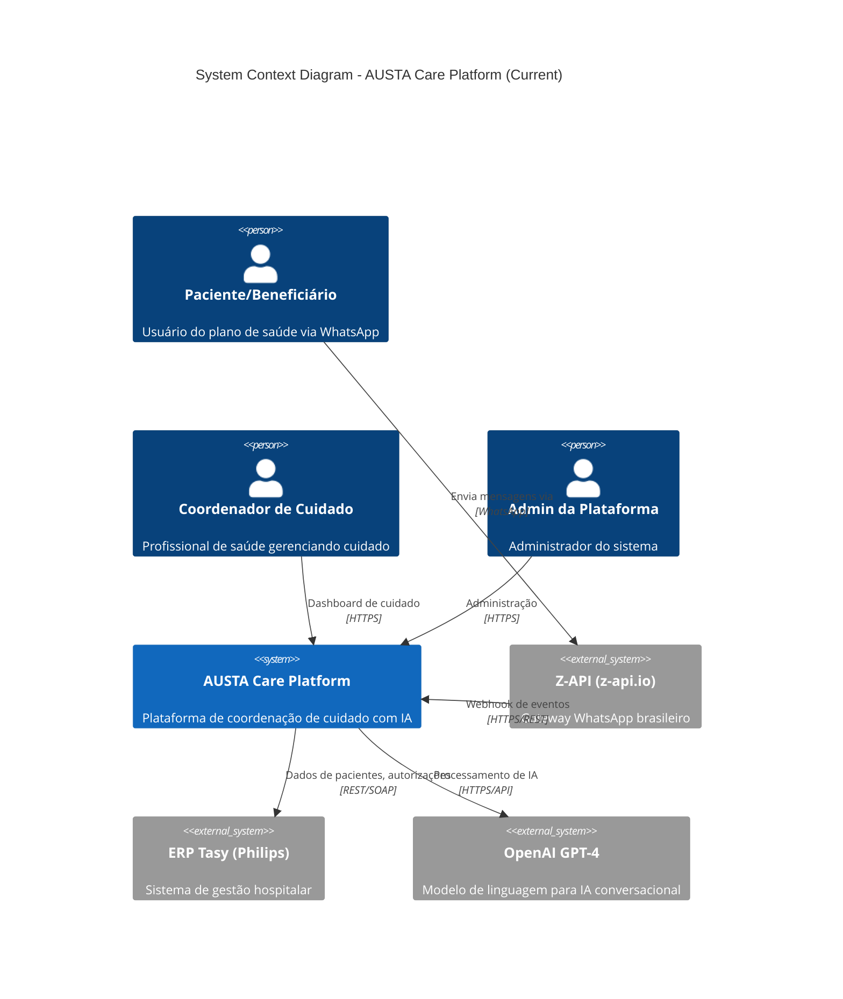
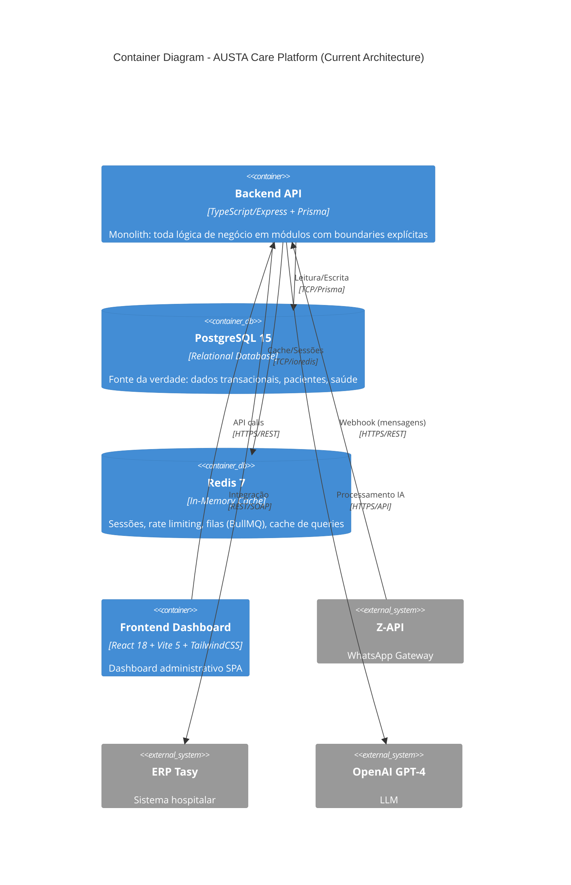
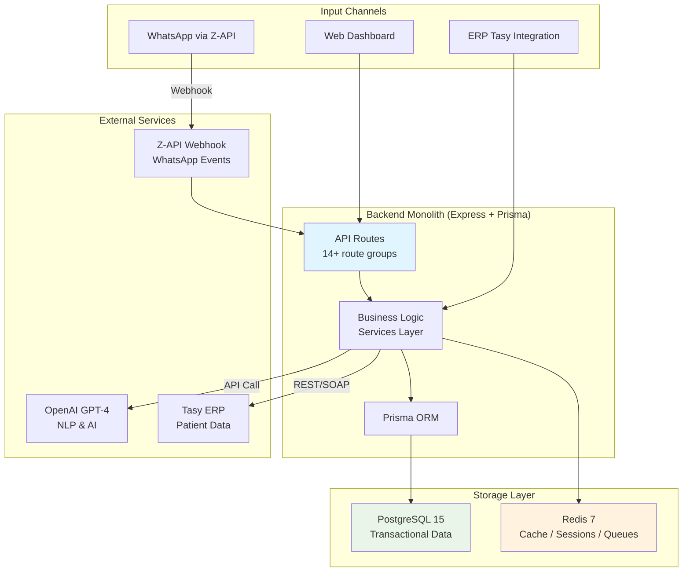
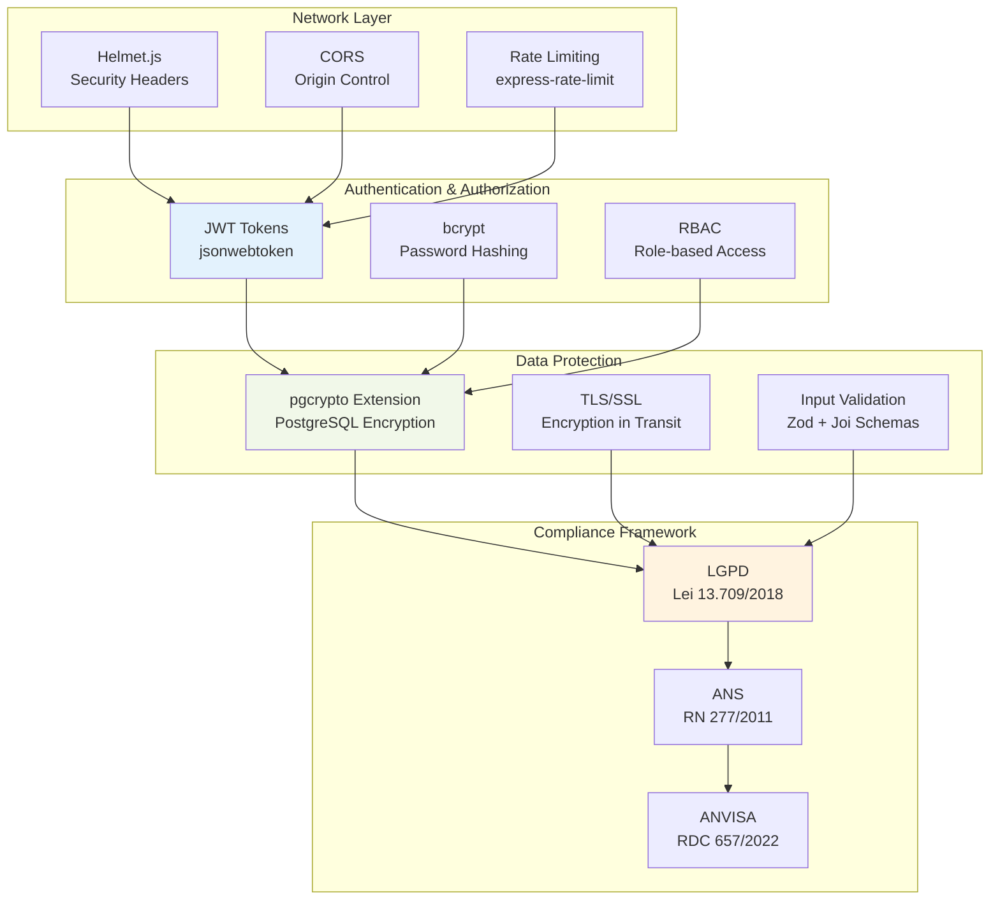
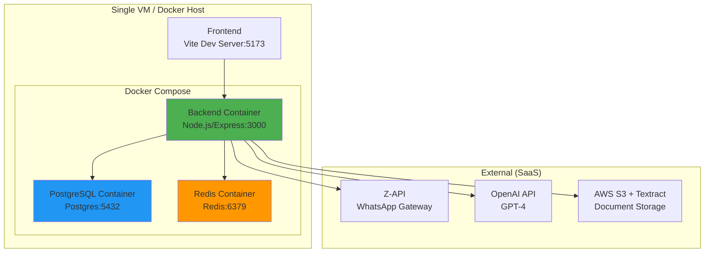
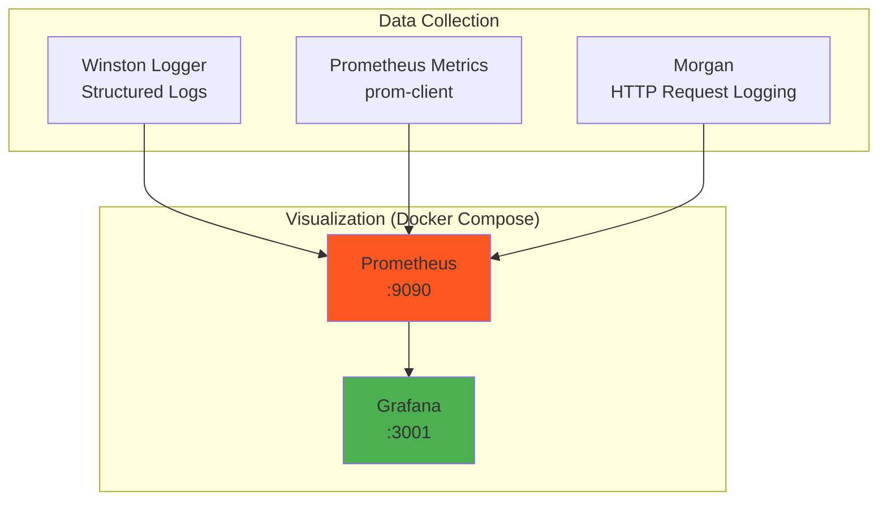

# 🎨 System Architecture Diagrams: AUSTA Care Platform

**Version:** 2.0
**Date:** June 26, 2026
**Purpose:** Honest architectural representation — current state + future aspirations

> ⚠️ **IMPORTANT NOTE:** The diagrams below are split into **CURRENT** (what actually exists in the codebase right now) and **FUTURE** (target architecture for later phases). The previous version of this document (v1.0, July 2025) described a 12-container microservices architecture that did NOT exist. This v2.0 corrects that.

---

## 📋 Current vs Target Architecture Summary

| Aspect | Current (MVP — June 2026) | Target (Fase 3+) |
|--------|---------------------------|-------------------|
| **Runtime services** | 3 containers | 6-8 containers |
| **Backend** | 1 TypeScript monolith (Express) | 4-5 microservices extraídos |
| **Database** | PostgreSQL 15 | PostgreSQL 15 (permanece) |
| **Cache** | Redis 7 | Redis 7 (permanece) |
| **Message broker** | In-process EventEmitter | Apache Kafka (quando necessário) |
| **WhatsApp** | Z-API (z-api.io) | Z-API + potencial multi-provedor |
| **Deploy** | Docker Compose (single VM) | Kubernetes (EKS) |
| **Frontend** | React 18 + Vite 5 | React 18 + Vite 5 (permanece) |
| **ADR Reference** | ADR-003 | ADR-003 § Plano de Evolução |

---

## 📊 C4 Context Diagram (CURRENT)



**Nota:** Z-API substitui WhatsApp Business API (Meta). Ver ADR-003 para detalhes da decisão de provedor.

---

## 🏗️ Container Diagram (CURRENT — Modular Monolith)



**Nota:** A arquitetura atual é um **modular monolith** — todos os 14+ módulos (auth, conversations, health-data, risk-assessment, ai, ocr, authorization, gamification, etc.) rodam em um único processo Express. Microserviços serão extraídos sob demanda (ver ADR-003).

---

## 🏗️ Container Diagram (FUTURE — Target Fase 3+)

```mermaid
C4Container
    title Container Diagram - AUSTA Care Platform (Future Target)

    Container(web, "Frontend Dashboard", "React 18 + Vite 5", "SPA administrativa")

    Container(gateway, "API Gateway", "Nginx/Kong", "Roteamento, rate limiting, TLS")
    Container(chat, "Chat Service", "TypeScript/Express", "Processamento WhatsApp")
    Container(care, "Care Coordination", "TypeScript/Express", "Coordenação de cuidado, autorizações")
    Container(ai, "AI/ML Service", "TypeScript/Express", "Análise de risco, NLP, ML")
    Container(integration, "Integration Hub", "TypeScript/Express", "Tasy, FHIR, externals")

    ContainerDb(postgres, "PostgreSQL 15", "Relational DB", "Dados transacionais")
    ContainerDb(redis, "Redis 7", "Cache", "Sessões, filas, cache")

    Rel(web, gateway, "API calls", "HTTPS")
    Rel(gateway, chat, "Routes", "HTTPS")
    Rel(gateway, care, "Routes", "HTTPS")
    Rel(gateway, ai, "Routes", "HTTPS")
    Rel(gateway, integration, "Routes", "HTTPS")

    Rel(chat, postgres, "Read/Write", "TCP")
    Rel(care, postgres, "Read/Write", "TCP")
    Rel(ai, postgres, "Read/Write", "TCP")

    Rel(chat, redis, "Cache", "TCP")
    Rel(care, redis, "Cache", "TCP")

    UpdateLayoutConfig($C4_SHAPE, "aspiracional")
```

---

## 🔄 Data Flow Architecture (CURRENT)



**Nota:** Kafka, MongoDB, Data Lake, e outros componentes do diagrama v1.0 foram removidos por não estarem em uso. Ver ADR-003 para justificativa. O processamento de eventos é in-process (EventEmitter) nesta fase.

---

## 🔐 Security Architecture (CURRENT)



**Nota:** HIPAA foi substituído por LGPD/ANS/ANVISA (ver ADR-001). pgcrypto para envelope encryption de PHI (ver ADR-004). RBAC implementado via middleware de roles em TypeScript.

---

## 📡 Integration Architecture (CURRENT)

```mermaid
graph TB
    subgraph "AUSTA Backend (Monolith)"
        A[Integration Services<br/>TypeScript Modules]
        B[Webhook Handlers]
        C[API Clients]
    end

    subgraph "WhatsApp"
        D[Z-API (z-api.io)<br/>Gateway Brasileiro]
    end

    subgraph "Healthcare Systems"
        E[ERP Tasy<br/>Philips]
        F[HAPI FHIR Server<br/>Planejado]
    end

    subgraph "AI Services"
        G[OpenAI GPT-4<br/>Chat Completions]
        H[LangChain<br/>Orquestração IA]
    end

    subgraph "Storage"
        I[AWS S3<br/>Documentos]
        J[AWS Textract<br/>OCR]
    end

    B --> D
    C --> E
    C --> F
    C --> G
    A --> H
    A --> I
    C --> J

    style A fill:#e1f5fe
    style D fill:#f3e5f5
```

**Nota:** A integração é feita por módulos TypeScript dentro do monolith, não por um Integration Hub separado. O HAPI FHIR Server está no `docker-compose.infrastructure.yml` mas não é ativamente utilizado pelo código.

---

## 🚀 Deployment Architecture (CURRENT)



**Nota:** O deploy atual é via Docker Compose em VM única. Kubernetes manifests existem em `k8s/` mas são aspiracionais (Fase 3+). Não há multi-cloud nem multi-region atualmente.

---

## 📊 Monitoring & Observability (CURRENT)



**Nota:** Stack de observabilidade atual é Winston (logs) + Prometheus (métricas) + Grafana (dashboards). Jaeger, Elasticsearch, e Kibana estão no `docker-compose.infrastructure.yml` como infraestrutura opcional, mas não são integrados ao código.

---

## 🎯 Diagram Usage Guidelines

### For Development Teams
- Use **Container Diagram (CURRENT)** para entender boundaries reais dos módulos
- Reference **Data Flow (CURRENT)** para padrões de processamento
- Consulte os **ADRs** em `docs/architecture/adr/` para decisões arquiteturais documentadas

### For Operations Teams
- Deploy seguindo `docker-compose.yml` (runtime real)
- `docker-compose.infrastructure.yml` contém serviços opcionais/planejados
- Monitore via Prometheus + Grafana em `:3001`

### For Business Stakeholders
- **C4Context** mostra o panorama real de sistemas
- A plataforma opera como **modular monolith** — simples, eficaz, pronta para evoluir
- Microserviços serão extraídos quando houver demanda real de escala

### For Compliance Teams
- Framework regulatório: **LGPD/ANS/ANVISA** (não HIPAA) — ver ADR-001
- Criptografia PHI: pgcrypto envelope encryption — ver ADR-004
- Algoritmos clínicos versionados — ver ADR-005
- Idempotência de mensagens para integridade de dados — ver ADR-006

---

## 📚 Architecture Decision Records (ADRs)

Decisões arquiteturais formais estão documentadas em `docs/architecture/adr/`:

| ADR | Título | Status |
|-----|--------|--------|
| ADR-001 | Substituição HIPAA → LGPD/ANS/ANVISA | Accepted |
| ADR-002 | Classificação ANVISA SaMD (RDC 657/2022) | Accepted |
| ADR-003 | Arquitetura Monolith-First para MVP | Accepted |
| ADR-004 | Envelope Encryption com pgcrypto para PHI | Accepted |
| ADR-005 | Versionamento de Algoritmos Clínicos | Accepted |
| ADR-006 | Idempotência para Mensagens WhatsApp/FHIR/Tasy | Accepted |

---

## 🔮 Roadmap Arquitetural

| Fase | Arquitetura | Gatilho |
|------|-------------|---------|
| **Fase 1 (MVP — Atual)** | Monolith + PostgreSQL + Redis | Agora |
| **Fase 2 (Growth)** | Monolith + BullMQ filas assíncronas | > 1.000 usuários ativos |
| **Fase 3 (Scale)** | Extrair AI/ML service se CPU > 2x baseline | > 10.000 usuários ativos |
| **Fase 4 (Enterprise)** | Microserviços por domínio | Múltiplos times independentes |
